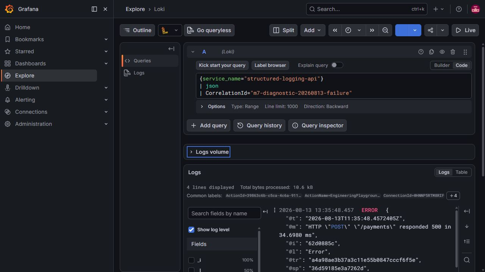

# Structured Logging & Observability

## Overview

This Proof of Concept demonstrates how structured logging, contextual logging, request correlation, and centralized log search support production-style diagnostics in an ASP.NET Core API. A deliberately small payment flow provides enough request and business context to make the diagnostic workflow realistic.

The PoC is about designing useful logs and investigating a failure with Loki and Grafana. It is not a complete observability platform: metrics, distributed tracing, alerting, and OpenTelemetry are outside its scope.

## The Problem

Plain-text logs are easy to write but difficult to use when a production service handles many requests concurrently. Messages from unrelated operations become interleaved, arbitrary text searches are fragile, and identifiers or status values may be missing or formatted inconsistently. Reconstructing one failed request then depends on timestamps and guesswork.

Containerized services add another problem: output is distributed across application instances and container lifetimes. Inspecting each container separately does not scale into a reliable incident-investigation workflow.

## Why Structured Logging Exists

Compare a rendered message:

```text
Payment processing failed for payment 123
```

with an event that retains queryable data:

```json
{
  "PaymentId": "123",
  "CustomerId": "11111111-1111-1111-1111-111111111111",
  "Operation": "ProcessPayment",
  "CorrelationId": "client-request-42",
  "PaymentStatus": "Pending"
}
```

A message template such as `Payment processing failed for payment {PaymentId}` preserves `PaymentId` as a named property. String interpolation embeds the value only in rendered text. Keeping values as data makes filtering reliable and lets one event carry both a readable message and machine-queryable context.

## Example Scenario

The API accepts a payment, invokes an in-process simulated gateway, marks a successful payment as completed, and stores it in PostgreSQL. This business flow is intentionally minimal; it exists only to demonstrate logging across a realistic operation and a deterministic failure.

## Architecture

See the [architecture diagram](diagrams/architecture.mmd) and the [diagnostic sequence diagram](diagrams/sequence.mmd).

- **Client** sends `POST /payments` and receives `X-Correlation-ID` in the response.
- **API** validates the request, coordinates payment processing, and applies EF Core migrations at startup in non-production environments.
- **Domain** defines the payment rules and the gateway contract without depending on persistence or logging infrastructure.
- **Infrastructure** implements PostgreSQL persistence and the deterministic simulated gateway.
- **PostgreSQL** stores successfully completed payments.
- **Serilog** is the logging provider. Application code depends on `ILogger<T>`; it does not call Serilog directly.
- **Loki** receives the structured Serilog events and provides centralized storage and LogQL search.
- **Grafana** provides the Explore interface used to query Loki and inspect event fields.

## Logging Model

The PoC separates context by lifetime so each log call contains only event-specific information.

### Request context

`CorrelationId` lives for one HTTP request. Middleware creates the request logging scope before the controller runs, so logs produced by the controller, payment processor, gateway, and request-completion middleware inherit the same value.

### Operation context

`PaymentId`, `CustomerId`, and `Operation` describe one payment-processing operation. `PaymentProcessor` adds them once with an `ILogger` scope, and nested logs inherit them while that scope is active.

### Event-specific data

Properties such as `Amount`, `Currency`, and `PaymentStatus` describe a particular event. Where a status changes, `PreviousPaymentStatus` and `PaymentStatus` preserve the transition. These values stay in the relevant message template instead of being repeated as stable scope data. This separation keeps logging calls concise while preserving enough context to explain each state change.

## Correlation ID

The correlation header is:

```text
X-Correlation-ID
```

The API preserves a valid incoming value. If the header is absent, empty, repeated, longer than 128 characters, or contains control characters, middleware generates a 32-character GUID value. The selected value is returned in `X-Correlation-ID`, and application and request-completion logs emitted inside the middleware scope contain it.

A correlation identifier is diagnostic metadata, not trusted business data. It does not authorize a request and should not be used as a payment or customer identity. It is not distributed tracing and does not establish parent-child spans. A distributed system may propagate correlation metadata through downstream HTTP or message headers; this PoC's gateway is in-process, so distributed propagation is not implemented.

## Centralized Logging

Serilog writes structured JSON events to the console and sends them to Loki. Grafana queries Loki, so a developer can search the combined event stream instead of inspecting individual container output.

Loki labels and structured fields serve different purposes:

- A label identifies a log stream and is indexed. The configured `service_name="structured-logging-api"` value is stable and low-cardinality, so it is a suitable label. The sink also handles the small log-level set as a label.
- A structured field remains in the JSON event and is parsed at query time. `CorrelationId`, `PaymentId`, and `CustomerId` are high-cardinality values and deliberately are **not** Loki labels.

Turning every unique request or business identifier into a label would create too many streams and increase index and query costs. These identifiers remain searchable after `| json` without increasing label cardinality.

## Diagnostic Scenario

The simulated gateway fails deterministically when `Amount` is exactly `13.37`. Other valid amounts use the successful flow.

To investigate the failure:

1. Send the failing request shown in [Failure Scenario](#failure-scenario).
2. Receive `500 Internal Server Error` with a generic problem-details response.
3. Copy the `X-Correlation-ID` response-header value.
4. Open [Grafana Explore](http://localhost:3000/explore) and select the provisioned **Loki** data source.
5. Search for the request:

   ```logql
   {service_name="structured-logging-api"}
   | json
   | CorrelationId="<correlation-id>"
   ```

6. Inspect the operation context: `CustomerId`, `Operation`, amount, currency, and pending status are available as structured fields.
7. Copy the `PaymentId` from the payment events and, if needed, run the payment query below.
8. Inspect the gateway invocation and the payment-processor error event.
9. Read the recorded exception: the `SimulatedPaymentGateway` rejected the diagnostic amount `13.37`.

The payment is created in memory before the gateway call, which gives the trail a `PaymentId`. Persistence occurs only after a successful gateway result, so the failed payment is not stored in PostgreSQL.

The following screenshot was captured from the running local stack using the verified correlation query. It shows the four-event trail, including the structured HTTP 500 event.



## Running the Example

From `02-structured-logging`, start the complete environment:

```bash
docker compose up --build
```

Docker Compose starts these services:

| Service | Local access | Purpose |
| --- | --- | --- |
| `postgres` | Internal port `5432` | Payment persistence |
| `api` | <http://localhost:8080> | Payment API |
| `loki` | <http://localhost:3100> | Central log storage and query API |
| `grafana` | <http://localhost:3000> | Log exploration UI |

Grafana starts with Loki provisioned as its default data source. Unless overridden through environment variables, the local credentials are `admin` / `admin`; Grafana may ask you to skip or change the default password after the first sign-in.

The API waits for PostgreSQL to become healthy and applies pending EF Core migrations automatically because Docker Compose runs it in `Development`. Production environments must apply migrations through a controlled deployment process.

Stop the environment while retaining local volumes:

```bash
docker compose down
```

Reset the database, logs, and Grafana state:

```bash
docker compose down -v
```

## Successful Scenario

Send a valid payment:

```bash
curl -i -X POST http://localhost:8080/payments \
  -H "Content-Type: application/json" \
  -d '{"customerId":"11111111-1111-1111-1111-111111111111","amount":100.00,"currency":"EUR"}'
```

The API returns `201 Created`, a completed payment response, and `X-Correlation-ID`. Searching for that correlation identifier shows the payment start, gateway result, status transition from `Pending` to `Completed`, persistence, completion, and HTTP request result with shared context.

## Failure Scenario

Send the deterministic failure amount:

```bash
curl -i -X POST http://localhost:8080/payments \
  -H "Content-Type: application/json" \
  -d '{"customerId":"11111111-1111-1111-1111-111111111111","amount":13.37,"currency":"EUR"}'
```

The API returns `500 Internal Server Error` with a generic problem-details body and an `X-Correlation-ID` response header. Copy that header value, open Grafana Explore, and run the correlation query from the diagnostic scenario. Internal exception details stay out of the HTTP response but remain available in the structured error event.

## Useful LogQL Queries

All Structured Logging API logs:

```logql
{service_name="structured-logging-api"}
```

One request:

```logql
{service_name="structured-logging-api"}
| json
| CorrelationId="<correlation-id>"
```

One payment:

```logql
{service_name="structured-logging-api"}
| json
| PaymentId="<payment-id>"
```

These queries were verified against the current Serilog JSON format and Loki configuration.

## Trade-offs

Structured, centralized logs provide machine-queryable context, consistent diagnostic metadata, correlation across an operation, and faster incident investigation. They also require logging infrastructure, storage, ingestion capacity, and disciplined event design.

Poor choices are costly: high-cardinality labels can harm log-system performance, while excessive events create noise and increase storage and ingestion cost. Useful logging therefore depends on selecting stable context, meaningful events, and appropriate log levels rather than recording everything.

## When to Use

Structured logging is especially useful for production APIs, distributed systems, background processors, highly concurrent workloads, and systems that require operational troubleshooting. It remains valuable even when events are written only to a structured console sink.

Centralized logging is a separate decision. Loki and Grafana become useful when events span instances, containers, or services and need one searchable location; they are not required merely to adopt structured logging.

## When NOT to Use / Avoid Overengineering

A tiny local utility may benefit from readable console output without needing centralized logging infrastructure. Not every value deserves a structured property, and not every structured property should become a Loki label.

Logs should not replace metrics for aggregate health or traces for end-to-end distributed timing. They must not contain secrets, credentials, card data, authorization data, or other sensitive values that the logging platform is not authorized to store. Even identifiers and transaction attributes such as `CustomerId` and `Amount` require an explicit data-handling policy in a real system.

## Production Considerations

A production deployment would need explicit log-retention and sensitive-data policies, authentication and authorization for Grafana and Loki, durable production storage, high availability, alerting, and capacity planning. Sampling may be appropriate for high-volume events.

Metrics, OpenTelemetry, and distributed tracing would complement these logs in a broader observability design. They are production extensions, not implemented features of this PoC.

## Key Takeaways

- Logs become substantially more useful when context is preserved as queryable data.
- Stable request and operation context belongs in logging scopes.
- A correlation identifier makes one request reconstructable across interleaved events.
- High-cardinality business identifiers should remain structured fields unless there is a deliberate reason to index them as labels.
- Centralized search is only as useful as the structure and consistency of the application events sent to it.
