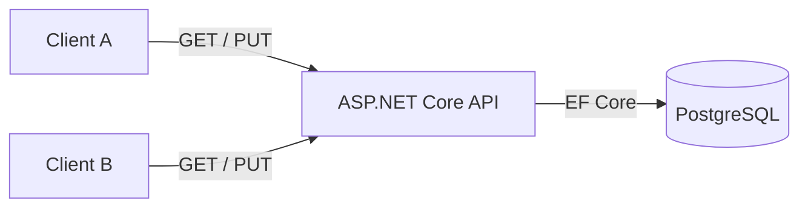
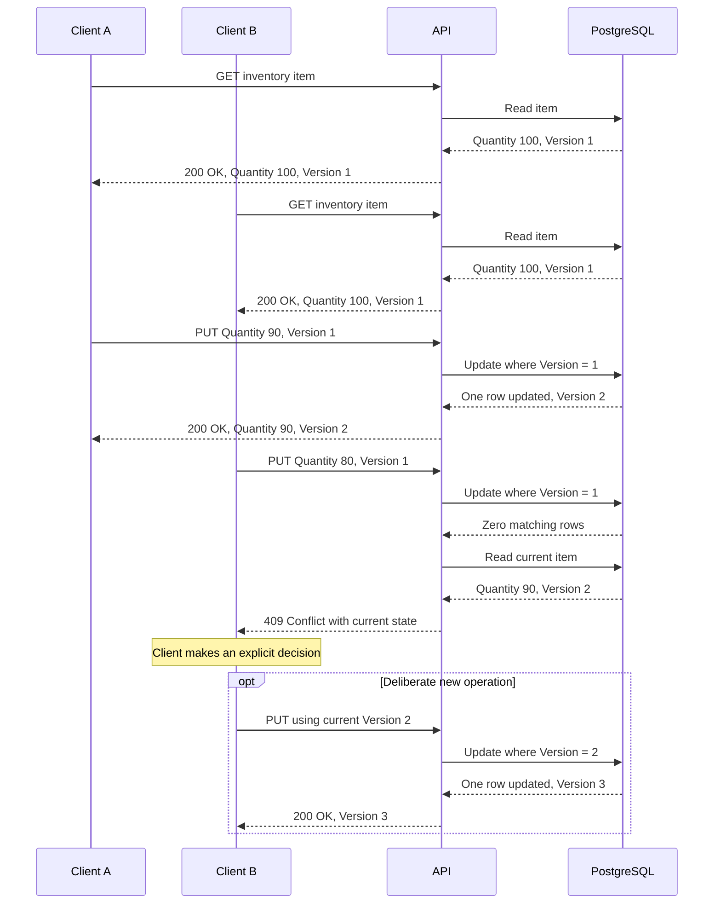

# Optimistic Concurrency

## Overview

This Proof of Concept shows why technically successful updates can still produce an incorrect business result, and how version-based optimistic concurrency prevents a client from silently overwriting newer state. It uses .NET 10, ASP.NET Core Controllers, Entity Framework Core, PostgreSQL, and Docker Compose.

The learning path is:

```text
Normal update
      ↓
Lost update
      ↓
Why successful writes can still be incorrect
      ↓
Version-based optimistic concurrency
      ↓
Conflict detection
      ↓
409 Conflict
      ↓
Explicit client decision
```

## The Problem

A normal database update can commit successfully and still produce the wrong business outcome. Consider two clients working from the same inventory state:

```text
Initial Quantity = 100

Client A reads 100
Client B reads 100

Client A decides Quantity should become 90
Client B decides Quantity should become 80
```

Without concurrency protection, both writes can succeed:

```text
A writes 90
B writes 80

Final Quantity = 80
```

Client A's valid update disappeared without an error. A successful transaction only means that its own work committed; it does not prove that the decision was based on the latest resource state.

## Lost Update

A **lost update** occurs when clients read the same state, make independent decisions, and a later write silently replaces an earlier write. The problem is not necessarily database corruption, a failed transaction, simultaneous CPU execution, or invalid SQL. Both writes may be individually valid and successful.

The deterministic M3 scenario was:

```text
Client A reads Quantity = 100
Client B reads Quantity = 100

Client A sets Quantity = 90 and saves
Client B sets Quantity = 80 and saves

Both saves succeed
Final Quantity = 80
```

Client B's representation was valid when read, but it became stale after Client A committed. Client B then made a write using that stale state and silently erased the newer value.

## Why Optimistic Concurrency Exists

> Conflicts are possible, but uncommon enough that we prefer detecting them when writing rather than locking the resource for the entire operation.

The protected workflow is:

```text
Read resource + version
        ↓
Work with resource
        ↓
Update using expected version
        ↓
Database checks version atomically
        ↓
success OR conflict
```

Optimistic concurrency does not hold a database lock while a client reads, thinks, or interacts with a user. It is a useful trade-off when conflicts are possible but relatively uncommon; it is not universally better than locking or other concurrency designs.

## Example Scenario

The deliberately small domain contains one seeded resource:

```text
InventoryItem

Id        = 11111111-1111-1111-1111-111111111111
Name      = Demo Item
Quantity  = 100
Version   = 1
```

`Id` is a `Guid`, `Name` is a string, `Quantity` is an integer, and `Version` is a signed 64-bit integer (`long` in .NET and `bigint` in PostgreSQL). Keeping the entity small makes the stale read and overwritten quantity easy to see without unrelated inventory behavior.

## Architecture



The API exposes only the read and quantity-update operations needed for the scenario. Its controller delegates persistence behavior to the inventory service, and EF Core accesses PostgreSQL through the infrastructure project. The standalone Mermaid source is in [`diagrams/architecture.mmd`](diagrams/architecture.mmd).

## How It Works

`InventoryItem.Version` is an explicit numeric concurrency token:

1. The client reads the item and its version.
2. The client submits its proposed quantity and the version it expects.
3. EF Core treats `Version` as a concurrency token through `IsConcurrencyToken()`.
4. The service supplies the client's version as the property's original value.
5. `InventoryDbContext` advances the version by one before saving a modified item.
6. EF Core includes the expected original version in the update condition.
7. If no row matches, EF Core throws `DbUpdateConcurrencyException`.

The resulting operation is conceptually equivalent to this SQL; it is illustrative, not a captured statement from EF Core:

```sql
UPDATE inventory_items
SET quantity = 90,
    version = 2
WHERE id = '11111111-1111-1111-1111-111111111111'
  AND version = 1;
```

With the current version, one row is updated and the version advances. With a stale version, zero rows match, so the stale quantity cannot overwrite the current row.

## Why the Check Must Be Atomic

This application-level sequence is not sufficient protection:

```text
SELECT current version

if version matches:
    UPDATE resource
```

Another transaction can update the resource after the `SELECT` but before the `UPDATE`. The expected version must participate in the actual database write condition so that checking and writing are one atomic database operation. Merely exposing a version in an API does not provide concurrency safety.

## Conflict Handling

The API route is `GET /inventory/{id}`. After a clean database start, the seeded item is returned as `200 OK`:

```json
{
  "id": "11111111-1111-1111-1111-111111111111",
  "name": "Demo Item",
  "quantity": 100,
  "version": 1
}
```

The update route is `PUT /inventory/{id}`. Its request body contains only the proposed quantity and expected version:

```json
{
  "quantity": 90,
  "version": 1
}
```

A valid current version returns `200 OK` with the updated resource and advanced version:

```json
{
  "id": "11111111-1111-1111-1111-111111111111",
  "name": "Demo Item",
  "quantity": 90,
  "version": 2
}
```

A stale version returns `409 Conflict`. Internal EF Core exception details are not exposed:

```json
{
  "message": "The inventory item was modified by another client.",
  "current": {
    "id": "11111111-1111-1111-1111-111111111111",
    "name": "Demo Item",
    "quantity": 90,
    "version": 2
  }
}
```

The HTTP behavior is:

- a valid current version updates the resource;
- a stale version returns `409 Conflict` with the current state;
- a missing resource returns `404 Not Found` for either route;
- a negative quantity, a version below `1`, or another model-validation failure returns `400 Bad Request` using ASP.NET Core's validation problem response.

## Concurrent Clients Scenario

Clients are concurrent here because they operate on overlapping logical state. Their requests do not need to execute at the same CPU instant.

```text
Client A reads Version = 1
Client B reads Version = 1

Client A
PUT Quantity = 90, Version = 1
        ↓
success
        ↓
Version = 2

Client B
PUT Quantity = 80, Version = 1
        ↓
409 Conflict
```

Client A's update remains stored. Client B receives the current quantity and version in the conflict response:

```text
Client B receives current state
        ↓
Client B decides what to do
        ↓
optional new request using Version = 2
```

That optional request is a **new business decision** based on fresh state, not an automatic retry of the stale operation.



The standalone Mermaid source is in [`diagrams/concurrent-update-sequence.mmd`](diagrams/concurrent-update-sequence.mmd).

## Detection vs Resolution

### Detection

Optimistic concurrency answers:

> Has this resource changed since I read it?

### Resolution

The business or client workflow decides whether to discard local changes, reload, merge, ask the user, or execute another business operation.

> Optimistic concurrency detects conflicts. It does not resolve them.

This PoC deliberately implements detection only. It does not automatically retry, merge, or overwrite newer data.

## Running the Example

From `03-optimistic-concurrency`, start the complete environment with:

```bash
docker compose up --build
```

Compose starts two services:

- `postgres`, using PostgreSQL 18 with a health check and a persistent `postgres-data` volume;
- `api`, available by default at `http://localhost:8083` and started after PostgreSQL is healthy.

The API runs in the Development environment under Compose. On startup, non-production environments apply pending EF Core migrations and ensure the deterministic demo item exists. Production does not apply migrations automatically and requires a controlled migration process.

The defaults in `.env.example` use PostgreSQL on `localhost:5432` and the API on `localhost:8083`. Copy that file to `.env` only when values need to be overridden.

Stop the services while retaining database state:

```bash
docker compose down
```

Reset the local database and remove its volume:

```bash
docker compose down -v
```

The reset command deletes the Compose-managed local database volume. The next `docker compose up --build` recreates the schema and seeds `Quantity = 100, Version = 1`.

## Manual Concurrency Walkthrough

Start with a clean local database so the literal versions below are deterministic:

```bash
docker compose down -v
docker compose up --build
```

In another terminal, Client A reads the item:

```bash
curl -i http://localhost:8083/inventory/11111111-1111-1111-1111-111111111111
```

Client B independently reads the same item before either client updates it:

```bash
curl -i http://localhost:8083/inventory/11111111-1111-1111-1111-111111111111
```

Both responses show `quantity: 100` and `version: 1`. Client A updates using the version it read:

```bash
curl -i -X PUT http://localhost:8083/inventory/11111111-1111-1111-1111-111111111111 \
  -H "Content-Type: application/json" \
  -d '{"quantity":90,"version":1}'
```

The response is `200 OK` with `quantity: 90` and `version: 2`. Client B still holds version `1`, so its update is stale:

```bash
curl -i -X PUT http://localhost:8083/inventory/11111111-1111-1111-1111-111111111111 \
  -H "Content-Type: application/json" \
  -d '{"quantity":80,"version":1}'
```

The response is `409 Conflict`; its `current` property shows `quantity: 90` and `version: 2`. Confirm that Client A's update remains stored:

```bash
curl -i http://localhost:8083/inventory/11111111-1111-1111-1111-111111111111
```

After evaluating the current state, Client B may deliberately submit a new operation:

```bash
curl -i -X PUT http://localhost:8083/inventory/11111111-1111-1111-1111-111111111111 \
  -H "Content-Type: application/json" \
  -d '{"quantity":80,"version":2}'
```

This new request returns `200 OK` with `quantity: 80` and `version: 3`. If the volume was not reset, use the versions returned by the `GET` and conflict responses rather than assuming `1` and `2`.

## Tests

The integration-test project uses a real PostgreSQL 18 Testcontainer and verifies the behavior at three levels:

### Persistence-level concurrency test

Two separate EF Core contexts read the same row. The first save advances the version; the second save throws `DbUpdateConcurrencyException`, and verification confirms the stale quantity was not stored.

### API conflict tests

Endpoint tests verify successful updates advance the version, stale versions become `409 Conflict` with the current representation, invalid requests become `400 Bad Request`, and missing resources become `404 Not Found`.

### End-to-end concurrent-client scenario

Two independent HTTP clients exercise the complete deterministic workflow:

```text
read → read → update → conflict → reload → explicit decision
```

The final update is deliberately issued with the current version, proving that conflict resolution remains an explicit client action.

Run the tests with Docker available:

```bash
dotnet test
```

## Trade-offs

### Advantages

- No long-lived database locks while clients work with a resource.
- Simple detection of stale writes.
- Good fit when conflicts are relatively uncommon.
- Explicit protection against silently overwriting newer state.

### Costs

- Clients must carry version information.
- Conflicts require explicit handling.
- Business workflows may become more complex.
- High-contention resources may produce frequent conflicts and repeated client work.
- Conflict detection does not solve domain-level merge decisions.

## When to Use

Optimistic concurrency is often appropriate for:

- editable business entities and administrative systems;
- user-modifiable API resources that may be held for some time;
- systems where concurrent modification is possible but usually uncommon;
- workflows where silently overwriting newer state is unacceptable.

These are design signals, not universal rules. The decision depends on contention and business semantics.

## When Not to Use

Another strategy may be more appropriate for:

- very high-contention resources;
- operations requiring strict serialization;
- workflows where locking is intentionally part of the business process;
- append-only models where lost updates are structurally avoided;
- operations naturally expressed as an atomic database command instead of read-modify-write.

## Important: Atomic Operations

Not every concurrency problem requires entity versioning. Depending on its business meaning, decrementing stock may be better represented as one atomic database operation:

```sql
UPDATE inventory_items
SET quantity = quantity - 1
WHERE id = ...
  AND quantity > 0;
```

That design avoids a separate resource read for a command whose meaning is simply "decrement if stock remains." Version-based optimistic concurrency is especially relevant when a client reads a resource representation, makes a decision from it, and later writes a replacement state. This PoC intentionally uses that read-modify-write scenario.

## Production Considerations

- Retry policy depends on business semantics. Automatically repeating a stale business operation is not always safe.
- Conflict rates should be observable because frequent conflicts may indicate that the design does not fit the workload.
- A version token may be kept opaque to clients even when its implementation is numeric.
- HTTP APIs can express optimistic concurrency with ETags and `If-Match`; this PoC uses an explicit JSON version for clarity and does not implement ETags.
- Database isolation levels and optimistic concurrency address related but different concerns. A transaction boundary alone does not guarantee protection from stale read-modify-write decisions.
- High-contention or strictly serialized workflows may need a different concurrency design.

These are production design considerations, not extensions implemented by this example.
