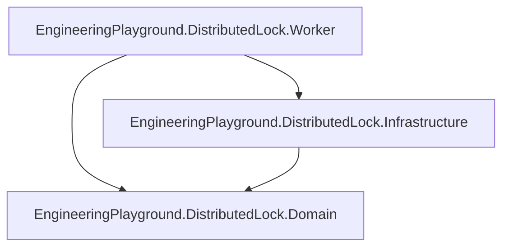
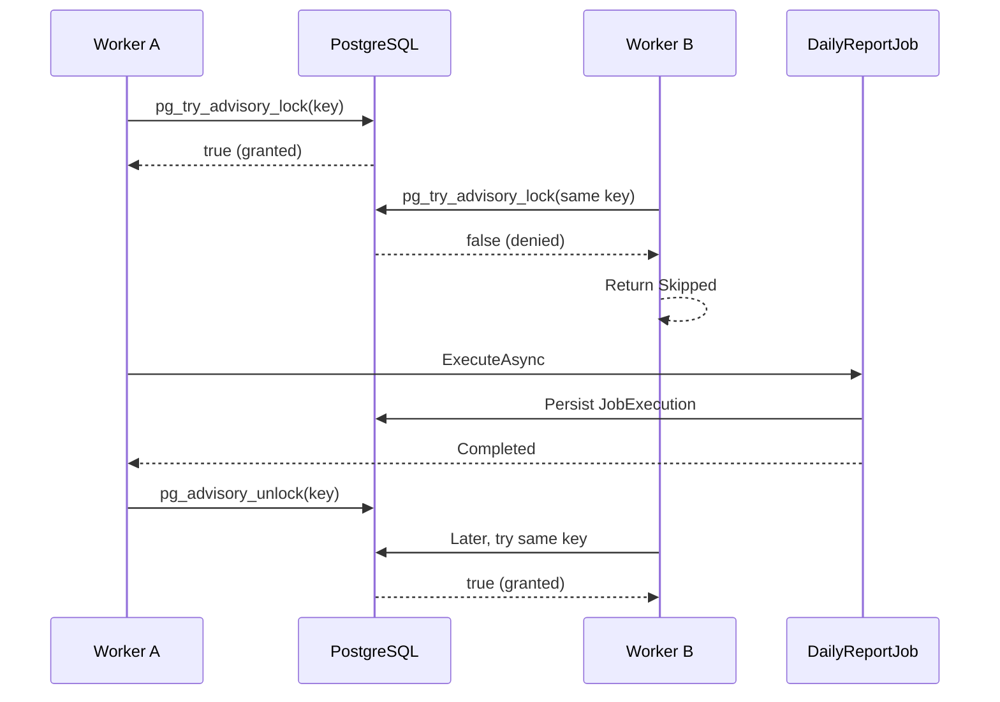

# Distributed Lock

## Overview

This Proof of Concept demonstrates coordination between independent .NET Worker
instances with **PostgreSQL session-level advisory locks**. The important problem
is not concurrency between threads in one process; it is multiple application
instances attempting the same logical job at the same time.

The example uses .NET 10 Worker Services, PostgreSQL, EF Core for execution
persistence, and Docker Compose. It follows this progression:

```text
same logical job
        ↓
multiple independent instances
        ↓
no shared coordination
        ↓
duplicate execution
        ↓
distributed lock
        ↓
one lock owner
        ↓
one protected execution
```

## The Problem

`worker-a` and `worker-b` both run `DailyReportJob`. Each Worker can independently
decide to execute the same logical operation, identified by:

```text
JobName + ExecutionKey
```

Without shared coordination, both decisions are valid locally:

```text
Worker A                       Worker B
   |                              |
   | same logical job             | same logical job
   |                              |
   | execute                      | execute
   |                              |
   +---------- PostgreSQL --------+
              two executions
```

The duplicate `JobExecutions` rows are evidence of the problem. The real problem
is that two independent application instances performed the same logical
operation.

## Duplicate Execution

The retained unprotected scenario executes two `DailyReportJob` instances with
the same `JobName` and `ExecutionKey`. Both executions succeed, and PostgreSQL
stores both rows because the schema intentionally has no unique constraint on
those columns.

In production, duplicate execution might send a notification twice, generate a
report twice, repeat maintenance, or invoke an external operation twice. A
distributed lock is one possible coordination mechanism; it is not the right
answer to every duplicate-execution problem.

## Why In-Process Locks Are Not Enough

`lock` and `SemaphoreSlim` coordinate callers that share one application
process. These Workers do not share memory:

```text
Worker process A              Worker process B

SemaphoreSlim A               SemaphoreSlim B
      ↓                             ↓
local memory                   local memory
```

Each Worker could acquire its own in-process lock and still execute concurrently.
In this PoC, both instead consult shared coordination infrastructure:

```text
Worker A ──┐
           ├── PostgreSQL advisory lock
Worker B ──┘
```

## Example Scenario

The configured logical job is:

```text
JobName       = daily-report
ExecutionKey  = 2026-09-13
```

`WorkerInstance` is `worker-a` or `worker-b`, but it is not part of the logical
job identity. Every participant targeting the same operation must derive the
same advisory-lock key from `JobName + ExecutionKey`.

Both containers are one-shot Workers. They attempt the job once and then stop.
The two-second `PROTECTED_WORK_DURATION_SECONDS` setting makes their competition
easy to observe; it is not a scheduling, retry, or locking mechanism.

## How the Distributed Lock Works

`DailyReportJobRunner` performs the following flow:

```text
attempt logical job
      ↓
derive deterministic lock key
      ↓
open dedicated PostgreSQL connection
      ↓
pg_try_advisory_lock
      ↓
 acquired?
   /       \
 yes        no
  |          |
execute     skip
  |
pg_advisory_unlock
  |
dispose connection
```

Acquisition is non-blocking. `pg_try_advisory_lock` returns immediately, so a
Worker that loses the competition returns `Skipped` instead of waiting,
polling, or retrying. The owner runs `DailyReportJob`, which creates and
completes a `JobExecution` through EF Core.

### Why PostgreSQL Advisory Locks

PostgreSQL was already needed to persist the observable job result. Its advisory
locks coordinate independent database sessions, session ownership gives the lock
a clear lifecycle, and no Redis service or additional lock library is necessary.
That keeps this PoC focused; it does not imply that PostgreSQL advisory locks are
universally preferable to Redis-based locks.

## Lock Identity

`PostgresAdvisoryLockKey.Create` constructs this byte sequence:

```text
UTF-8(JobName) + null separator + UTF-8(ExecutionKey)
```

It hashes the sequence with SHA-256 and interprets the first eight bytes as a
signed, big-endian 64-bit integer for PostgreSQL's advisory-lock key. The result
is stable across processes and runtime restarts. `string.GetHashCode()` would be
inappropriate because its result is not a stable distributed coordination
contract. As with any fixed-size hash key, a collision is theoretically possible.

## Lock Ownership and Session Lifetime

> A PostgreSQL session-level advisory lock belongs to the database session that
> acquired it.

```text
Connection / Session A
        ↓
pg_try_advisory_lock(key)
        ↓
Session A owns the lock
```

While session A owns the lock, session B receives `false` from
`pg_try_advisory_lock` for the same key. `PostgresAdvisoryLock` therefore opens a
dedicated `NpgsqlConnection` and keeps that connection—and its underlying
session—alive throughout the protected operation. Ownership cannot be moved to
another connection, and another session cannot unlock session A's lock.

## Explicit and Automatic Release

The normal path explicitly releases the lock on the owning session:

```text
open session
    ↓
acquire
    ↓
execute
    ↓
pg_advisory_unlock on the owning session
    ↓
dispose connection
```

`DailyReportJobRunner` disposes the lock lease in a `finally` block, including
when the protected operation throws. If the process or database session
disappears before that cleanup, PostgreSQL ends the session and automatically
releases its session-level advisory locks:

```text
acquire
    ↓
process / database session disappears
    ↓
PostgreSQL ends the session
    ↓
lock is released
```

This mechanism has no TTL, lease timer, or renewal loop. Its failure semantics
come from database-session lifetime, unlike a TTL-based Redis-style lease.

### Connection Pooling

Connection pooling matters because the lock belongs to the physical database
session. Returning a still-locked connection to the pool could expose that
session and lock state to unrelated later work. The implementation explicitly
unlocks first and only then disposes the dedicated connection. A failed
acquisition disposes its connection immediately. If an acquisition or unlock
command fails with ambiguous session state, the pool is cleared before disposal
so that physical session is not reused. The session-loss integration test
disables pooling so disposing the owner deterministically terminates the
physical session.

## Multi-Instance Scenario

```text
Worker A                     PostgreSQL                     Worker B

try lock
   ---------------------------->
                              granted

                                                       try same lock
                                                       ----------->
                                                              denied

execute job                                           skip

persist execution

unlock
   ---------------------------->

                                                       later attempt
                                                       ----------->
                                                              granted
```

During the competing attempt, only the lock owner enters `DailyReportJob` and
persists a row. The losing Worker skips without persisting. After the owner
releases the lock, a later attempt can acquire it. The integration test makes
this ordering deterministic with an EF Core interceptor and completion signals;
it does not depend on arbitrary delays.

## Failure Scenarios

- **The Worker cannot acquire the lock.** Another session owns it, so the Worker
  skips its current one-shot attempt.
- **The protected operation throws.** The runner's `finally` block disposes the
  lease, which normally releases the advisory lock before the exception
  propagates. If cleanup also fails, that failure is logged without replacing
  the original protected-operation exception.
- **The owning session disappears.** PostgreSQL releases the session-level lock
  when it ends, allowing a later session to acquire the key.
- **PostgreSQL is unavailable.** The Worker cannot use its coordination
  infrastructure and cannot safely acquire this lock. The implementation does
  not add retries or another lock provider.

## What the Lock Guarantees

> Participating Worker instances using the same advisory-lock protocol cannot
> concurrently enter the protected operation for the same lock key while one
> database session owns that lock.

PostgreSQL advisory locks are **cooperative**. They protect only code paths that
follow the same lock-key and acquisition convention. A process that ignores the
advisory lock can still perform the underlying business operation.

## What the Lock Does Not Guarantee

Distributed mutual exclusion is not universal exactly-once execution:

```text
acquire lock
      ↓
perform side effect
      ↓
side effect succeeds
      ↓
process crashes
      ↓
session ends
      ↓
lock becomes available
      ↓
another Worker executes later
```

The later Worker cannot learn from the lock alone whether the earlier side effect
succeeded. Depending on the operation, a production design may also need
idempotency, database constraints, transactional state, deduplication,
inbox/outbox patterns, or workflow state.

### Distributed Lock vs Database Constraint

A unique database constraint protects a data invariant such as “only one row
with this unique key.” A distributed lock coordinates entry into a broader
critical section. They are not interchangeable, and a lock does not remove the
need for constraints that independently express valid data.

### Distributed Lock vs Optimistic Concurrency

```text
Optimistic concurrency:             Distributed lock:
allow competing work                coordinate before protected work
        ↓                                      ↓
detect a conflicting write          only the lock owner enters
```

Optimistic concurrency detects that shared state changed before a write can
safely complete. A distributed lock decides who may enter protected work at a
given time.

## Architecture

The project dependencies remain small and point toward the Domain project:



At runtime, both Worker containers share PostgreSQL for coordination and
persistence. A one-shot migration process finishes before either Worker starts:

```text
worker-a ──┐
           │
           ├── postgres
           │      ├── session-level advisory locks
           │      └── JobExecutions records
           │
worker-b ──┘
```

See the standalone [architecture diagram](diagrams/architecture.mmd).

## Sequence Diagram



See the standalone [sequence diagram](diagrams/multi-instance-sequence.mmd).

## Running the Example

From `04-distributed-lock/`, start the complete environment with:

```bash
docker compose up --build
```

For a repeatable demonstration with an empty database volume:

```bash
docker compose down -v
docker compose up --build
```

Compose starts PostgreSQL, runs the one-shot `migrations` service, and starts
`worker-a` and `worker-b` only after migration succeeds. Both Workers target
`daily-report` / `2026-09-13`; the winner can be either instance. The migration
runner applies EF Core migrations automatically because it runs in
`Development` with `MIGRATE_ONLY=true`. No manual database creation or migration
command is required. Migration-only startup refuses to run in `Production`,
where a controlled migration step is required.

The logs identify attempts, acquisition, skipping, execution, and release with
structured `WorkerInstance`, `JobName`, and `ExecutionKey` values.

## Verifying the Result

After the clean-state workflow, inspect the real table and columns:

```bash
docker compose exec postgres psql -U postgres -d distributed_lock -c 'SELECT "JobName", "ExecutionKey", "WorkerInstance", "StartedAtUtc", "CompletedAtUtc", COUNT(*) OVER () AS "ExecutionCount" FROM "JobExecutions" ORDER BY "StartedAtUtc";'
```

For the shared `daily-report` / `2026-09-13` attempt, the result contains one row
and `ExecutionCount` is `1`. That row shows which Worker acquired the lock. If
`POSTGRES_DB` is overridden in `.env`, use that database name in the command.

## Tests

Run the integration suite with:

```bash
dotnet test
```

The suite uses a real PostgreSQL Testcontainer and verifies:

- `JobExecution` persistence and completion data;
- duplicate execution by two independent unprotected jobs;
- stable lock-key derivation;
- advisory-lock exclusivity across independent sessions;
- independent ownership for different logical execution keys;
- ownership-aware and explicit release;
- automatic release when the owner session ends;
- cleanup when protected work throws;
- failure of coordination infrastructure does not run the job unprotected;
- deterministic `Executed` and `Skipped` results for competing Workers;
- one persisted execution during competition; and
- later acquisition after release.

Docker must be available for these integration tests.

## Trade-offs

Benefits include shared coordination without additional infrastructure,
non-blocking acquisition, clear session ownership, and automatic cleanup when
the owning PostgreSQL session terminates.

The costs are a dependency on PostgreSQL availability, correctness coupled to
connection lifetime, cooperative participation, deterministic lock-key design,
one held database connection per active lock, and serialization of protected
work. Mutual exclusion still does not provide exactly-once semantics.

## When to Use

Use this approach for small critical sections shared by cooperating application
instances, such as a scheduled job triggered by multiple replicas, a maintenance
operation that one replica should perform, or singleton-like background work in
a replicated service—especially when PostgreSQL is already available.

## When Not to Use

Prefer a simpler mechanism when a database constraint or atomic update directly
expresses the invariant, when the operation can naturally be idempotent, or when
message-partition ownership already serializes the work. Avoid this approach when
work must be queued rather than skipped, when high throughput would be harmed by
serialization, or when the system needs stronger guarantees than cooperative
session-level mutual exclusion.

## Production Considerations

Evaluate idempotency, lock granularity, deterministic lock-key design,
PostgreSQL availability, connection-pool capacity, maximum protected-operation
duration, acquisition-failure observability, database constraints for separate
invariants, and failure boundaries around external side effects. Fencing tokens
can matter in some lease-based distributed-lock designs; they are not implemented
by this session-level advisory-lock example.
