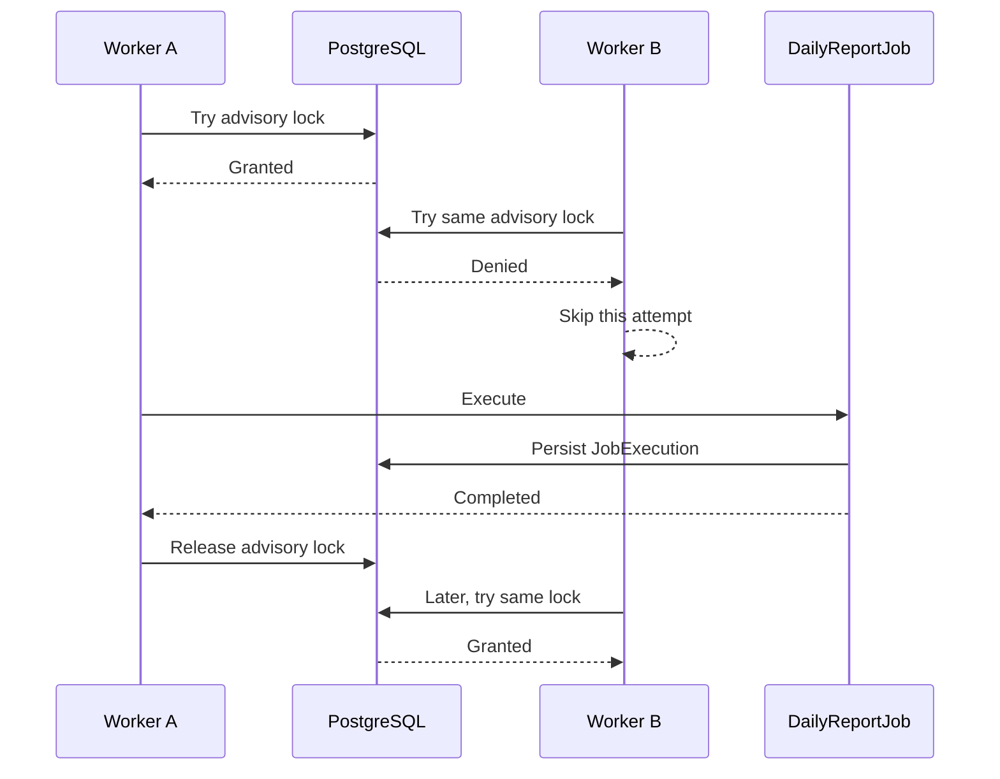

# Distributed Lock

This Proof of Concept demonstrates how multiple application instances coordinate
access to the same protected operation with a distributed lock.

> **Work in Progress**
>
> M6 adds the complete multi-instance walkthrough. M7 will perform the final
> documentation review.

## Problem

Two independent Worker processes can decide to run the same logical job. Without
shared coordination, each process can execute the operation successfully.

Both Workers receive the same logical job identity:

```text
JobName       ExecutionKey
daily-report  2026-09-13
```

`JobName` identifies the operation. `ExecutionKey` identifies the execution
window. `WorkerInstance` identifies the application instance that attempted the
job; it is not part of the logical job identity.

## Duplicate Execution

Before M4, the scenario was:

```text
Worker A                       Worker B
   |                              |
   | daily-report / 2026-09-13    | daily-report / 2026-09-13
   |                              |
   | execute                      | execute
   |                              |
   +---------- PostgreSQL --------+
              two records
```

PostgreSQL intentionally has no unique constraint on `(JobName, ExecutionKey)`.
The M3 integration test preserves evidence of this underlying unsafe path by
executing two unprotected `DailyReportJob` instances. Both records are accepted,
showing that persistence alone does not coordinate the Workers.

An in-process `lock` or `SemaphoreSlim` can coordinate threads that share one
process:

```text
lock / SemaphoreSlim
        ↓
coordinates threads in one process
```

Worker A and Worker B have separate memory, so each would own a different
in-process lock:

```text
PostgreSQL advisory lock
        ↓
coordinates independent processes through shared infrastructure
```

## Distributed Lock

M4 uses a **PostgreSQL session-level advisory lock**. PostgreSQL was selected
because it already exists in this PoC, advisory locks coordinate independent
database sessions rather than process-local memory, session ownership gives the
lock a clear lifecycle, and no Redis service or distributed-lock library is
needed.

Each Worker tries the lock once with `pg_try_advisory_lock`. This is non-blocking:
the Worker either becomes the owner immediately or logs that another instance
owns the lock and skips the current execution. There is no polling, retry, or
backoff.

`DailyReportJobRunner` protects only the business operation. `DailyReportJob`
still creates and completes the `JobExecution` record; unrelated Worker startup
and database-migration behavior remain outside the lock.

## Multi-Instance Scenario

Both Workers target `daily-report` with the same execution key. The logical job
identity therefore produces the same advisory-lock key in both processes:

```text
same logical job
      ↓
two Worker instances
      ↓
same distributed lock key
      ↓
one lock owner
      ↓
one job execution
```

The M6 integration scenario uses two independently configured dependency-
injection containers and scopes that share the PostgreSQL database. Worker A is
paused at its first save only after its dedicated PostgreSQL session owns the
lock. Worker B then uses its own lock session to make a non-blocking attempt and
receives `Skipped`. Releasing the test gate lets Worker A persist and complete
the execution, after which its owning session explicitly unlocks. A fresh
`DbContext` verifies that exactly one row exists and that it belongs to Worker A.
Finally, Worker B acquires the same lock successfully, proving re-acquisition
after release without creating a second job record.



The losing Worker does not wait indefinitely, execute the job, or persist a
`JobExecution`; it simply skips that attempt. A failed lock acquisition is not a
permanent job failure. It means another participating instance currently owns
the right to execute that logical operation, and a future attempt may succeed.
This PoC does not add a scheduler or define when such a future attempt occurs.

## Lock Key

The logical lock identity is `JobName + ExecutionKey`. The implementation joins
their UTF-8 representations with an explicit null separator, hashes that value
with SHA-256, and interprets the first eight hash bytes as a signed 64-bit
big-endian integer for PostgreSQL's advisory-lock key space.

This conversion is deterministic across processes and runtime restarts.
`string.GetHashCode()` is not used because it is runtime-randomized and is not a
stable coordination contract. As with any fixed-size hash, a collision is
theoretically possible.

## Lock Ownership and Session Lifetime

> A session-level PostgreSQL advisory lock belongs to the database session that
> acquired it.

```text
PostgreSQL session A
        ↓
acquires advisory lock
        ↓
session A owns lock
```

`PostgresAdvisoryLock` opens a dedicated `NpgsqlConnection` for each acquisition.
When acquisition succeeds, the connection remains open while `DailyReportJob`
executes. Another physical PostgreSQL session cannot acquire the same lock and
cannot release session A's lock:

```text
PostgreSQL session B
        ↓
tries the same advisory lock
        ↓
not granted
```

The ownership handle explicitly calls `pg_advisory_unlock` on the same connection
in the runner's `finally` cleanup path, then disposes the connection. A failed
acquisition closes its connection immediately and never attempts an unlock. The
database session itself is the ownership identity; there is no application token
or ownership table, and ownership cannot migrate to another connection.

### Explicit and Automatic Release

Explicit release is the normal application behavior:

```text
acquire
  ↓
work
  ↓
explicit unlock on the owning session
  ↓
close connection
```

If the process or connection disappears before cleanup, PostgreSQL session
lifetime provides the safety net:

```text
acquire
  ↓
process / connection disappears
  ↓
PostgreSQL session ends
  ↓
lock automatically released
  ↓
another session may acquire it
```

This PoC does not use timer-based expiration, TTL, or renewal. Those concepts are
common in Redis-style locks that use an ownership token plus TTL; PostgreSQL
session-level advisory locks instead use database-session ownership.

### Connection Pooling

Session-level advisory locks require care with connection pooling. Returning a
connection to its pool while it still owns a lock could transfer that live
session, and therefore its lock state, to unrelated later work. The normal path
always attempts the explicit unlock before disposing and returning the dedicated
connection. The session-loss integration test disables pooling for its two test
connections so disposing the owner deterministically terminates the physical
PostgreSQL session rather than merely returning it to a pool.

The ordinary EF Core `DbContext` connection lifecycle is not used as implicit
lock ownership.

### Lock Release Is Not Job Success

A successfully released lock means mutual exclusion ended; it does not mean the
business operation completed successfully. If protected work throws, the runner
logs the failure, attempts explicit unlock in its cleanup path, and lets the
original business exception propagate. Any partial side effects still require a
separate recovery or idempotency design, which is outside this PoC.

## Behavior and Limitations

The M6 guarantee is deliberately narrow:

> Competing participating Worker instances cannot simultaneously enter the same
> protected job execution while the advisory lock is held.

This is not a claim of exactly-once execution. Consider a process that performs
an external side effect and then crashes before recording completion. Its session
ends, PostgreSQL releases the lock, and another Worker may later repeat the side
effect. Idempotency, transactional state, deduplication, Outbox/inbox patterns,
or workflow state may address that broader problem; this PoC does not implement
them. Advisory locks also do not persist through a PostgreSQL restart and cannot
protect clients that ignore the locking protocol.

The approach is useful when a small number of cooperating processes already use
PostgreSQL and need mutual exclusion around a short logical operation. It is a
poor fit when the database should not be part of coordination, when work must be
queued rather than skipped, or when correctness requires durable state beyond a
database session.

## Tests

The integration suite uses a real PostgreSQL container and verifies:

- the M3 unprotected operation can still execute twice;
- participant A acquires a lock on one PostgreSQL session;
- participant B fails immediately on another session;
- participant A executes the protected job and releases the lock;
- participant B can acquire the same lock after release;
- a non-owner session cannot release the owner's lock;
- terminating a non-pooled owner session automatically releases its lock;
- a protected-operation failure still executes normal lock cleanup and preserves
  the business exception;
- two independently scoped job runners target the same logical job, return
  explicit `Executed` and `Skipped` results, and persist one execution belonging
  to the lock owner;
- the skipped Worker can acquire the same logical lock after the owner releases
  it.

The job-level test pauses Worker A at its first database save only after A has
entered the protected operation. Worker B then attempts the same logical job
before A is allowed to finish. Test synchronization uses explicit completion
signals, not delays or scheduler timing.

## Running the Example

From this directory, run:

```bash
docker compose down -v
docker compose up --build
```

This starts PostgreSQL, Worker A, and Worker B. Both Workers use `daily-report`
and execution key `2026-09-13`. During the competing attempt, the logs show one
Worker acquiring the distributed lock and the other skipping execution because
the lock is owned. The example configuration keeps the winning Worker inside the
protected operation for two seconds so the competing container can make its
single attempt while the lock is held. This delay makes the manual behavior easy
to observe; it is not a retry, scheduling, or locking mechanism, and the
deterministic integration test uses explicit signals instead of timing.

Worker A remains the non-production migration owner, while Compose no longer
waits for Worker A's job to finish before starting Worker B. No manual database
creation or migration command is required. Automatic migrations are disabled in
`Production`; production deployments require a controlled migration step.

The log progression identifies the attempt, acquisition, protected execution,
skip, completion, and release using structured `WorkerInstance`, `JobName`, and
`ExecutionKey` values. The winning instance can be either Worker:

```text
worker-a: Attempting job execution
worker-a: Distributed lock acquired
worker-b: Attempting job execution
worker-b: Distributed lock unavailable
worker-b: Job execution skipped
worker-a: Job execution started
worker-a: Job execution completed
worker-a: Distributed lock released
```

While PostgreSQL is running, verify the durable result and count with the actual
table and column names:

```bash
docker compose exec postgres psql -U postgres -d distributed_lock -c 'SELECT "JobName", "ExecutionKey", "WorkerInstance", COUNT(*) OVER () AS "ExecutionCount" FROM "JobExecutions" WHERE "JobName" = '\''daily-report'\'' AND "ExecutionKey" = '\''2026-09-13'\'';'
```

The competing logical job has one persisted execution:

```text
   JobName    | ExecutionKey |    WorkerInstance    | ExecutionCount
--------------+--------------+----------------------+---------------
 daily-report | 2026-09-13   | worker-a or worker-b |              1
```
