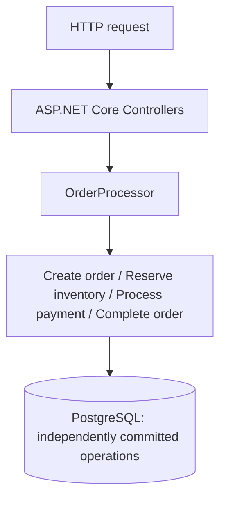

# Saga Pattern

> **Work in Progress** — M2 Running Application is complete. [Implementation plan](PLAN.md).
>
> Saga orchestration and compensating actions are intentionally not implemented yet.

## Scenario and motivation

An order is created, one inventory item is reserved, a simulated successful payment is recorded, and the order is completed. This milestone establishes the successful baseline for a business process whose operations commit independently. M3 will introduce a later failure to show why these boundaries matter.

The minimal domain contains `Order` (Id, Pending/Completed status, CreatedAtUtc), `InventoryItem` (Id, Name, AvailableQuantity, ReservedQuantity), and `Payment` (Id, OrderId, Amount, Succeeded status, CreatedAtUtc). The deterministic Demo Item starts with 10 available units and no reservations. Successful completion retains the reservation; fulfillment is outside this example.

## Implementation and transaction boundaries

The controller delegates to `OrderProcessor` in Infrastructure. Domain entities contain the small business behaviors. EF configuration and DbContext live in Infrastructure; Domain has no project dependencies. API references Domain and Infrastructure. There is no Application project.

Each of the four explicit operations creates and disposes its own DbContext and local database transaction. It awaits SaveChanges and COMMIT before returning. There is no outer transaction:

```text
Order commit → Inventory commit → Payment commit → Order completion commit
```

Using one PostgreSQL instance does not make the workflow atomic. At M2 every demo step succeeds. Inventory uses optimistic concurrency to reject a stale stock update; no retry policy is included.




## Running the example

From `05-saga-pattern`:

```bash
docker compose up --build
```

Compose starts PostgreSQL 17 and the .NET 10 API. PostgreSQL's healthcheck gates API startup. The API automatically applies the initial EF Core migration and deterministic inventory seed in Development (and other non-production environments). Production never migrates automatically and requires controlled migration execution before starting the API.

Defaults work without a `.env` file. Copy `.env.example` to `.env` to override local database credentials or ports. These defaults are local demo credentials. API is at http://localhost:8085; PostgreSQL is at localhost:5545.

```bash
curl -i -X POST http://localhost:8085/orders \
  -H "Content-Type: application/json" \
  -d '{"inventoryItemId":"11111111-1111-1111-1111-111111111111","quantity":1,"amount":100}'
```

The response contains `orderId`, `orderStatus: "Completed"`, and `paymentStatus: "Succeeded"`. Use the returned ID:

```bash
curl http://localhost:8085/orders/<orderId>
curl http://localhost:8085/inventory/11111111-1111-1111-1111-111111111111
docker compose logs api
```

After the first request, available inventory is 9 and reserved inventory is 1. Logs show Order created, Inventory reserved, Payment succeeded, and Order completed with structured IDs. Further requests consume more stock; keep requested quantity within available inventory. This milestone has no deliberate payment failure or compensation.

To reset only this PoC's data:

```bash
docker compose down -v
docker compose up --build
```

## Solution and tests

```text
EngineeringPlayground.Saga.sln
src/
  EngineeringPlayground.Saga.Api/
  EngineeringPlayground.Saga.Domain/
  EngineeringPlayground.Saga.Infrastructure/
tests/
  EngineeringPlayground.Saga.IntegrationTests/
```

```bash
dotnet format
dotnet build
dotnet test
docker compose config
```

Tests require a running Docker daemon. Testcontainers starts a separate PostgreSQL container with a dynamically allocated port for each test and waits for readiness. Migrations provide known inventory state. No local database reset or existing Compose environment is required. Tests inspect persisted state using fresh DbContexts: one covers the completed workflow; the other checks committed state after every operation before the next one begins. Containers are disposed after each test.

For host development, start Compose PostgreSQL and run the API with the Development profile. Its development connection string matches Compose defaults; override ConnectionStrings__Orders when changing database settings.

## Trade-offs and use

This small synchronous baseline makes separate commits easy to inspect without extra infrastructure. A failed later operation can leave previously committed state, and the current milestone provides no recovery, idempotency, or compensation. Payment is simulated, and inventory is aggregated rather than tracked per order.

Use this milestone to understand independently committed business operations and establish the successful scenario before adding failure behavior. Use a single local transaction when the actual business operation can and should be atomic. This incomplete milestone is not a production order or payment system.
