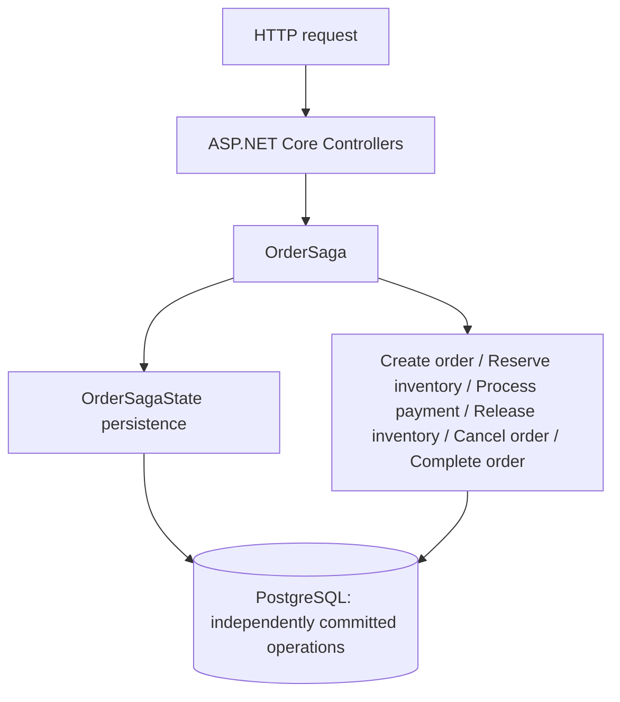
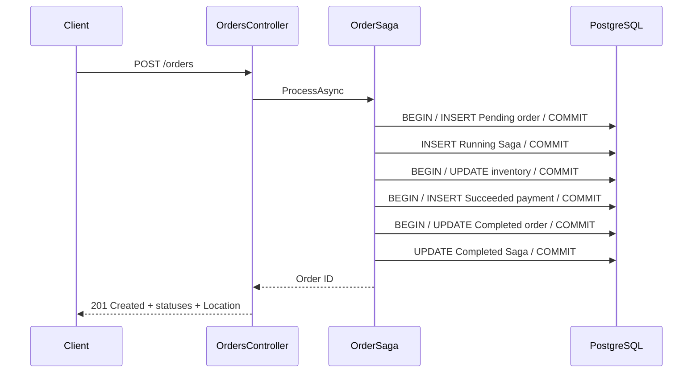
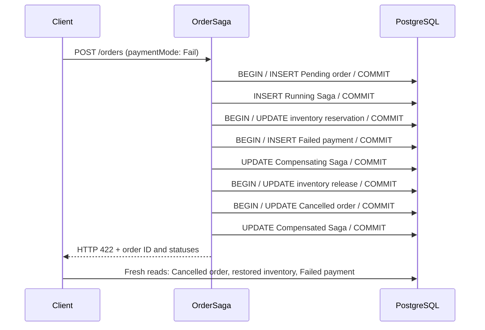
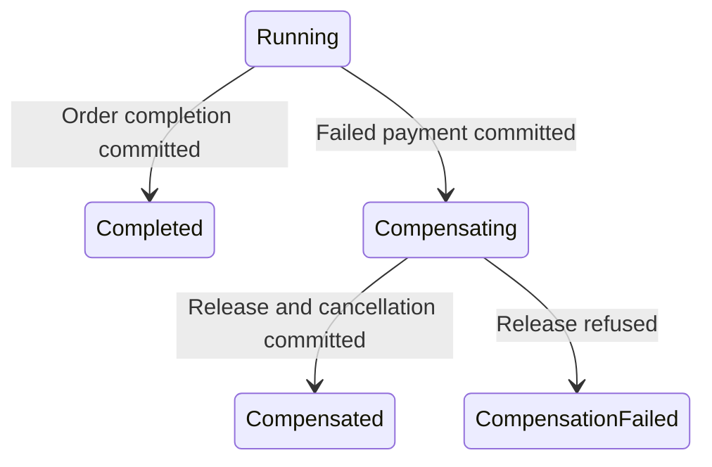
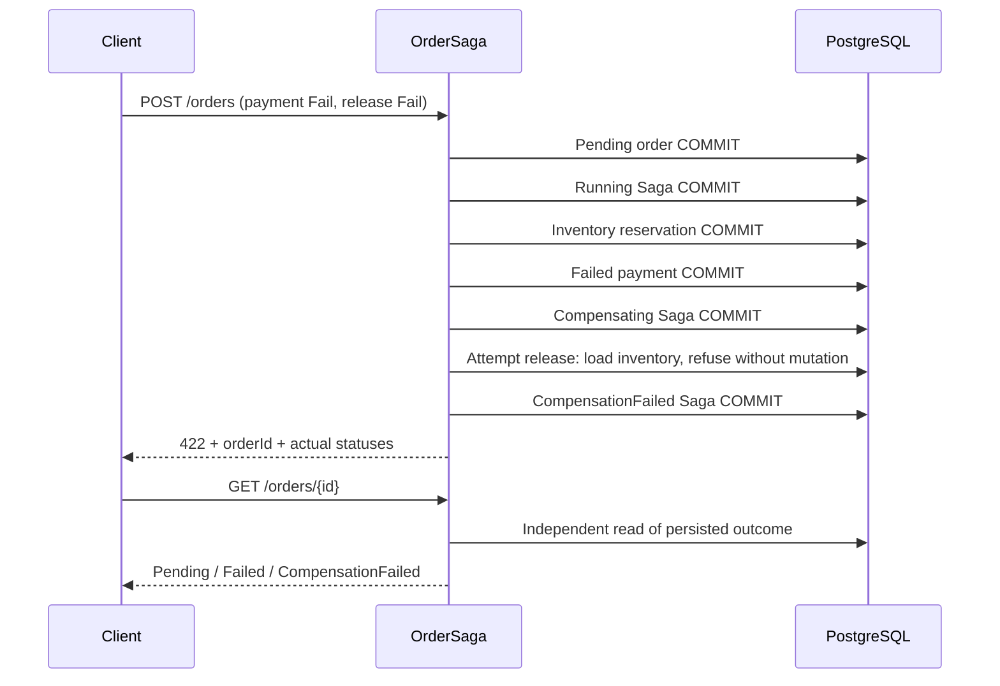

# Saga Pattern

> **Work in Progress** — M6 Saga State & Compensation Failure is complete. [Implementation plan](PLAN.md).
>
> An explicit Saga coordinates the workflow and compensates deterministic payment failure. Persisted Saga state exposes unresolved compensation failure.

## Scenario and motivation

An order is created, one inventory item is reserved, a simulated payment outcome is recorded, and the order is completed. The operations commit independently. M3/M4 exposed partial state after deterministic payment failure; M5 adds new committed operations to restore inventory and cancel the incomplete order.

The minimal domain contains `Order` (Id, Pending/Completed/Cancelled status, CreatedAtUtc), `InventoryItem` (Id, Name, AvailableQuantity, ReservedQuantity), and `Payment` (Id, OrderId, Amount, Succeeded/Failed status, CreatedAtUtc). The deterministic Demo Item starts with 10 available units and no reservations. Successful completion retains the reservation; fulfillment is outside this example.

## Implementation and transaction boundaries

The controller delegates to `OrderSaga` in Infrastructure. The Saga coordinates `OrderOperations`, which owns the independently committed persistence operations. Domain entities contain the small business behaviors. EF configuration and DbContext live in Infrastructure; Domain has no project dependencies. API references Domain and Infrastructure. There is no Application project.

Each explicit operation creates and disposes its own DbContext and local database transaction. It awaits SaveChanges and COMMIT before returning. There is no outer transaction:

```text
Order commit → Inventory commit → Payment commit → Order completion commit
```

Using one PostgreSQL instance does not make the workflow atomic. The default payment succeeds; an explicit payment failure releases inventory and cancels the order. Inventory uses optimistic concurrency to reject a stale stock update; no retry policy is included.





## Running the example

From `05-saga-pattern`:

```bash
docker compose up --build
```

Compose starts PostgreSQL 17 and the .NET 10 API. PostgreSQL's healthcheck gates API startup. The API automatically applies EF Core migrations and deterministic inventory seed in Development (and other non-production environments). Production never migrates automatically and requires controlled migration execution before starting the API.

Defaults work without a `.env` file. Copy `.env.example` to `.env` to override local database credentials or ports. These defaults are local demo credentials. API is at http://localhost:8085; PostgreSQL is at localhost:5545.

```bash
curl -i -X POST http://localhost:8085/orders \
  -H "Content-Type: application/json" \
  -d '{"inventoryItemId":"11111111-1111-1111-1111-111111111111","quantity":1,"amount":100}'
```

The response contains `orderId`, `orderStatus: "Completed"`, `paymentStatus: "Succeeded"`, and `sagaStatus: "Completed"`. Use the returned ID:

```bash
curl http://localhost:8085/orders/<orderId>
curl http://localhost:8085/inventory/11111111-1111-1111-1111-111111111111
docker compose logs api
```

After the first request, available inventory is 9 and reserved inventory is 1. Logs show Order created, Inventory reserved, Payment succeeded, and Order completed with structured IDs. Further requests consume more stock; keep requested quantity within available inventory. No compensation runs on the successful path.

To reset only this PoC's data:

```bash
docker compose down -v
docker compose up --build
```

## Solution and tests

```text
EngineeringPlayground.Saga.sln
src/
  EngineeringPlayground.Saga.Api/
  EngineeringPlayground.Saga.Domain/
  EngineeringPlayground.Saga.Infrastructure/
tests/
  EngineeringPlayground.Saga.IntegrationTests/
```

```bash
dotnet format
dotnet build
dotnet test
docker compose config
```

Tests require a running Docker daemon. Testcontainers starts an isolated PostgreSQL container for every test; migrations seed 10 available units and zero reserved units. Three primary tests send HTTP requests through the real API and verify final state using fresh DbContexts, including exactly one Saga state per order. They also read the outcome through GET /orders/{id}. Three focused tests retain coverage of independent forward commits, committed compensation operations, and release refusal after committed Compensating state. Containers are disposed after each test.

For host development, start Compose PostgreSQL and run the API with the Development profile. Its development connection string matches Compose defaults; override ConnectionStrings__Orders when changing database settings.

## Trade-offs and use

This small synchronous baseline makes separate commits easy to inspect without extra infrastructure. A failed later operation can leave previously committed state, and the current milestone provides no recovery or idempotency and exposes compensation failure. Payment is simulated, and inventory is aggregated rather than tracked per order.

Use this milestone to understand independently committed business operations and observe compensation after an independent inventory commit. Use a single local transaction when the actual business operation can and should be atomic. This incomplete milestone is not a production order or payment system.

## Partial Failure

Send a valid request selecting the deterministic failure outcome:

```bash
curl -i -X POST http://localhost:8085/orders \
  -H "Content-Type: application/json" \
  -d '{"inventoryItemId":"11111111-1111-1111-1111-111111111111","quantity":1,"amount":100,"paymentMode":"Fail"}'
```

Omitting `paymentMode` defaults to `Succeed`. Only `Succeed` and `Fail` are accepted; malformed selectors return 400 before processing. A valid `Fail` request returns HTTP 422 with `orderId`, `orderStatus: "Cancelled"`, `paymentStatus: "Failed"`, and `sagaStatus: "Compensated"`. Use that ID to inspect committed state:

```bash
curl http://localhost:8085/orders/<orderId>
curl http://localhost:8085/inventory/11111111-1111-1111-1111-111111111111
```

From a clean database, failure restores available inventory to 10 and reserved inventory to 0. If the successful walkthrough ran first, the totals remain 9 available and 1 reserved. The order remains persisted as Cancelled and the payment record remains Failed.



Order creation commits first, inventory reservation commits next, and only then does simulated payment fail. The failed outcome is recorded in its own committed transaction; this demo does not cause a database error or payment transaction rollback. Logs show Order created, Inventory reserved, Payment failed, Starting compensation, Inventory released, Order cancelled, and Compensation completed with structured identifiers.

A database rollback affects only the transaction being rolled back. If transaction A reserves inventory and commits, a failure or rollback in payment transaction B cannot retroactively undo A. The payment failure cannot roll back the already committed inventory transaction, leaving a partial business state.

The PoC intentionally preserves independent commit boundaries instead of wrapping all steps in one large transaction. In a distributed workflow these operations might belong to separate services, databases, or external providers. One PostgreSQL instance keeps this example small while exposing the same boundary problem.

M3/M4 deliberately left the order Pending and inventory reserved after payment failure. M5 replaces that final state with explicit compensation. Adding Cancelled requires no migration: order status already uses an unconstrained string column, and its schema and EF model mapping remain unchanged.

## Saga Orchestration

Before M4, sequential application logic in `OrderProcessor` owned the entire workflow. Now `OrderSaga` explicitly owns process progression: which step runs next, and what happens when payment fails. `OrderOperations` contains only the local database operations; there is exactly one process coordinator, with no outer transaction.

```text
Controller → OrderSaga
               ├── Create Order (COMMIT)
               ├── Reserve Inventory (COMMIT)
               ├── Process Payment (COMMIT)
               └── Payment succeeded? Complete Order (COMMIT)
                   Otherwise: Release Inventory (COMMIT) → Cancel Order (COMMIT)
```

Introducing a Saga orchestrator does not automatically undo previously committed work.

```text
M4: Reserve → COMMIT → Payment fails → Stop → Inventory remains reserved
M5: Reserve → COMMIT → Payment fails → Release → COMMIT → Cancel → COMMIT
```

The successful invocation leaves a Completed order, Succeeded payment, and persisted reservation. Payment failure with successful release leaves a Cancelled order, Failed payment, and restored inventory; a refused release leaves a Pending order and reserved inventory. Expected payment failure is a business result; unexpected infrastructure failures propagate as exceptions. Cancellation tokens pass through every step; cancellation does not compensate committed work.

This PoC uses orchestration because one explicit coordinator makes step order, decisions, failure flow, and future compensation easy to observe. M5 makes inventory release followed by order cancellation explicit in the failure branch. There is no choreography or messaging infrastructure.

## Compensating Actions

```text
Reserve Inventory
      ↓
COMMIT
      ↓
Payment fails
      ↓
Release Inventory
      ↓
COMMIT
      ↓
Cancel Order
      ↓
COMMIT
```

`Release Inventory` does not roll back the original transaction. It is a new business operation that compensates for the effect of the earlier reservation. `InventoryItem.Release(quantity)` restores available stock and reduces reserved stock, rejecting nonpositive quantities or releases larger than the reserved quantity. `OrderOperations.ReleaseInventoryAsync` persists this change in its own fresh DbContext and transaction after reservation and failed payment have committed.

Only the known Failed payment result after successful reservation triggers this branch. The Saga awaits the release commit before `CancelOrderAsync` commits the Pending order's transition to Cancelled. The order still exists as business history; the Failed payment remains unchanged because no successful payment needs reversal. For example, cancelling a hotel booking semantically compensates booking it rather than undoing the original database commit.

M6 persists process state and handles an explicit inventory release refusal. There is no retry or cancellation recovery. Unexpected infrastructure failures and request cancellation propagate rather than being treated as deterministic payment failure.


## Saga State

Before M6, payment failure could be compensated within one request. Once release can fail, durable state is needed to say that the process remains unresolved. `OrderSagaState` stores only Id, OrderId (unique foreign key), Status, CreatedAtUtc, and UpdatedAtUtc. It is created as Running after the order commit and before reservation. Each state save uses a fresh DbContext and its own SaveChanges transaction.



`Order.Status` describes business state; `OrderSagaState.Status` describes the coordinating process. Running means forward work is incomplete; Compensating means required compensating work is incomplete. Final states describe work known to have happened. GET /orders/{id} and POST /orders include `sagaStatus`; older or directly created orders without a Saga return null. Success returns 201; both payment-failure outcomes return 422 with the order ID and actual statuses.

Business commits and process-state commits are separate. A crash or cancellation between them can leave Running or Compensating even when a business operation committed. Unexpected exceptions propagate and are not labelled CompensationFailed. State alone supplies neither recovery nor exactly-once execution.

## Compensation Failure

```bash
curl -i -X POST http://localhost:8085/orders \
  -H "Content-Type: application/json" \
  -d '{"inventoryItemId":"11111111-1111-1111-1111-111111111111","quantity":1,"amount":100,"paymentMode":"Fail","inventoryReleaseMode":"Fail"}'
```

`inventoryReleaseMode` defaults to Succeed and accepts only Succeed or Fail. Fail deterministically refuses release inside `ReleaseInventoryAsync`, after loading committed inventory in the compensation operation and before changing stock. It matters only when payment fails; successful payment does not attempt release. Malformed selectors return 400 before processing.



Processing stops before cancellation. From clean state, inventory remains 9 available and 1 reserved, the order stays Pending, payment is Failed, and Saga is CompensationFailed. Repeat GET /orders/{id} and GET /inventory/11111111-1111-1111-1111-111111111111 to inspect independently. Inventory remains an aggregate counter, not a per-order reservation record.

The reservation already committed. The failed release is a new compensating business operation, not a failure to roll back the original transaction. Logs identify SagaId, OrderId and InventoryItemId and show entry into compensation and the final failure outcome.

PostgreSQL-backed tests cover Completed, Compensated and CompensationFailed using fresh contexts after processing returns. A focused operation test observes committed Compensating state before the real release refusal and verifies unchanged stock. Existing independent-business-commit tests remain.

Production could use compensation retries, delayed backoff, manual intervention, operator tooling and idempotent compensating operations. The appropriate choice depends on business requirements. M6 implements none of these: there is no startup scan, worker, retry or resume endpoint. Topology remains postgres and api.

## End-to-End Scenarios

M7 verifies the complete HTTP → Controller → OrderSaga → EF Core → PostgreSQL path. The PoC remains **Work in Progress**; M8 documentation is pending.

Each row below assumes a fresh database with 10 available units and zero reserved units, and requests one unit:

| Scenario | Request selectors | HTTP | Order | Payment | Saga | Available / reserved |
| --- | --- | --- | --- | --- | --- | --- |
| Success | Defaults | 201 | Completed | Succeeded | Completed | 9 / 1 |
| Payment failure, compensation succeeds | `paymentMode: Fail` | 422 | Cancelled | Failed | Compensated | 10 / 0 |
| Compensation failure | Both selectors `Fail` | 422 | Pending | Failed | CompensationFailed | 9 / 1 |

```bash
# Success
curl -i -X POST http://localhost:8085/orders \
  -H "Content-Type: application/json" \
  -d '{"inventoryItemId":"11111111-1111-1111-1111-111111111111","quantity":1,"amount":100}'

# Payment failure with successful compensation
curl -i -X POST http://localhost:8085/orders \
  -H "Content-Type: application/json" \
  -d '{"inventoryItemId":"11111111-1111-1111-1111-111111111111","quantity":1,"amount":100,"paymentMode":"Fail"}'

# Payment failure followed by refused inventory release
curl -i -X POST http://localhost:8085/orders \
  -H "Content-Type: application/json" \
  -d '{"inventoryItemId":"11111111-1111-1111-1111-111111111111","quantity":1,"amount":100,"paymentMode":"Fail","inventoryReleaseMode":"Fail"}'
```

Use each response's `orderId` with `GET /orders/{orderId}` and inspect stock with `GET /inventory/11111111-1111-1111-1111-111111111111`. Repeat the reads after compensation failure: Pending / Failed / CompensationFailed and the reservation remain durable and intentionally unresolved. No automatic recovery runs.

If these requests run sequentially after one clean startup, inventory totals are respectively 9 / 1, 9 / 1, and 8 / 2. Successful compensation restores only that request's reservation. The focused commit-boundary tests prove that reservation is already durable before failed payment, and release and cancellation are new committed business operations.
