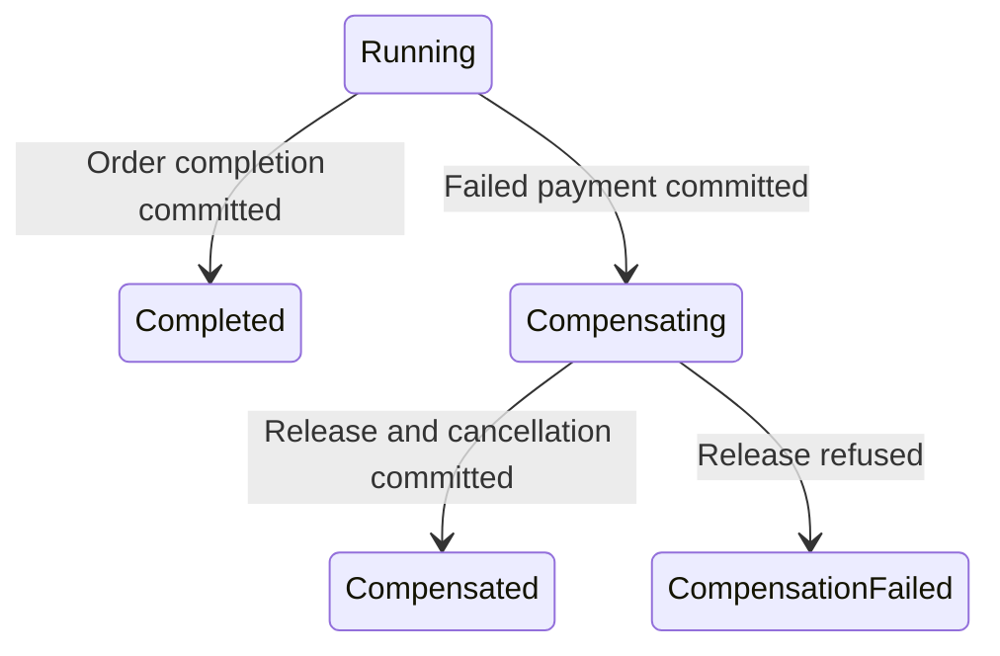

# Saga Pattern

## Overview

A Saga coordinates a business process composed of independently committed operations. When a later operation fails, previously committed work cannot simply be rolled back, so the process uses compensating business actions.

This PoC demonstrates Saga semantics in one synchronous ASP.NET Core application against one PostgreSQL instance. Independent commit boundaries teach the pattern without introducing microservices solely for architectural appearance.

## The Problem and Partial Failure

```text
Create Order → COMMIT
Reserve Inventory → COMMIT
Process Payment → success or failure
Complete Order → COMMIT (only on success)
```

When payment fails, the order already exists and inventory is already reserved. The business process is incomplete despite successful earlier local transactions. This is partial business failure.

## Why a Single Rollback Is Not Enough

Transaction A reserves inventory and commits. Transaction B processes payment later. Failure or rollback in B cannot retroactively roll back committed A.

Here, simulated payment failure actually commits a `Failed` payment record; it is a business result, not a database transaction error. There is no transaction spanning the entire Saga. Production boundaries may correspond to separate services, databases, or external providers, but Saga requires neither separate databases nor microservices. Prefer one local ACID transaction if it safely solves the actual problem.

## Example Scenario

| Entity | Meaning |
| --- | --- |
| `Order` | ID, creation timestamp, and business status: `Pending`, `Completed`, or `Cancelled`. |
| `InventoryItem` | Available/reserved aggregate quantities. Seeded Demo Item: `11111111-1111-1111-1111-111111111111`, 10 available units, zero reserved. |
| `Payment` | Simulated `Succeeded` or `Failed` result, amount, order ID, ID, and creation timestamp. No external provider. |
| `OrderSagaState` | ID, unique order ID, process status, creation/update timestamps. |

Success keeps inventory reserved; there is no fulfillment step. Inventory is an aggregate counter, not a per-order reservation record. Payment and Saga state each have a unique foreign key to the order.

## Saga Orchestration

`OrdersController` invokes `OrderSaga`, which calls `OrderOperations` and persists process state through `OrderSagaStateService`:

```text
Create Order → Start Saga → Reserve Inventory → Process Payment
  Succeeded → Complete Order → Completed Saga
  Failed → Compensating Saga → Release Inventory
    Released → Cancel Order → Compensated Saga
    Refused → CompensationFailed Saga
```

The orchestrator decides what executes next, whether forward processing continues, when compensation starts, and which final process outcome to persist.

**Orchestration** uses an explicit coordinator. **Choreography** lets participants react to events without one central process coordinator. Orchestration makes boundaries, failure decisions, compensation, and Saga state easy to observe here.

There is no message broker. Processing is synchronous within the HTTP request. Messaging is not required to demonstrate core Saga concepts; asynchronous messaging may be appropriate for production boundaries.

## Compensating Actions

Payment failure after reservation triggers inventory release followed by order cancellation:

```text
Payment fails → Release Inventory → COMMIT → Cancel Order → COMMIT
```

**Compensation is not rollback.** `ReleaseInventoryAsync` executes a new business operation in a new transaction after the original reservation committed:

```text
Transaction A: Reserve Inventory → COMMIT
... later, after payment failure ...
Transaction B: Release Inventory → COMMIT
```

`InventoryItem.Release(quantity)` increases available stock and reduces reserved stock. It rejects nonpositive quantities and releases exceeding reserved stock. The Saga waits for release to commit before cancelling the Pending order.

Compensation is semantic: it attempts to restore an acceptable business state without erasing history. The order remains persisted as `Cancelled`; payment remains `Failed`. No successful payment needs refunding in this path.

## Saga State

`Order.Status` describes the business entity; `OrderSagaState.Status` describes the coordinating process. Durable process state makes completed and unresolved outcomes inspectable after the request ends.

| Saga status | Meaning here |
| --- | --- |
| `Running` | Created after the order commit, before reservation; forward work incomplete. |
| `Completed` | Order completion committed and successful process outcome saved. |
| `Compensating` | Failed payment committed; compensating work about to run. |
| `Compensated` | Release and cancellation committed; compensation outcome saved. |
| `CompensationFailed` | Deterministic release refusal recorded; process unresolved. |



The entity stores `Id`, `OrderId`, `Status`, `CreatedAtUtc`, and `UpdatedAtUtc`. It does not store sufficient workflow input or provide a mechanism for automatic resumption.

## Compensation Failure

```text
Reserve Inventory COMMIT → Failed Payment COMMIT → Compensating Saga COMMIT
→ Release Inventory refused → CompensationFailed Saga COMMIT
```

Deterministic refusal occurs after loading committed inventory, before stock mutation. Cancellation is skipped: Order = `Pending`, Payment = `Failed`, inventory remains reserved, Saga = `CompensationFailed`. This intentional unresolved outcome remains observable. Saga does not guarantee successful compensation or automatic recovery.

Unexpected infrastructure exceptions and request cancellation propagate rather than becoming the demonstrated business failure/refusal outcomes. They do not automatically compensate earlier commits.

## End-to-End Scenarios

Each row assumes a fresh database and a one-unit request:

| Scenario | Selectors | HTTP | Order | Payment | Saga | Available / reserved |
| --- | --- | --- | --- | --- | --- | --- |
| Success | Defaults | 201 | Completed | Succeeded | Completed | 9 / 1 |
| Payment failure, compensation succeeds | `paymentMode: Fail` | 422 | Cancelled | Failed | Compensated | 10 / 0 |
| Compensation failure | Both modes `Fail` | 422 | Pending | Failed | CompensationFailed | 9 / 1 |

Running all three examples sequentially after one clean startup gives inventory totals **9 / 1**, **9 / 1**, then **8 / 2**. Compensation releases only its request's reserved quantity.

## Transaction Boundaries

Each `OrderOperations` operation owns a fresh `OrderDbContext` and explicit local transaction. Saga-state saves use another fresh context and an independent `SaveChangesAsync` transaction. No transaction spans the complete Saga.

```text
Success:
Create Order COMMIT → Running Saga COMMIT → Reserve Inventory COMMIT
→ Succeeded Payment COMMIT → Complete Order COMMIT → Completed Saga COMMIT

Payment failure:
Create Order COMMIT → Running Saga COMMIT → Reserve Inventory COMMIT
→ Failed Payment COMMIT → Compensating Saga COMMIT
→ Release Inventory COMMIT → Cancel Order COMMIT → Compensated Saga COMMIT

Release refusal:
... → Compensating Saga COMMIT → Release refused (no stock mutation or commit)
→ CompensationFailed Saga COMMIT
```

### Crash-consistency limitation

Business commits and process-state commits are separate. A crash after release commits but before cancellation or saving `Compensated` can leave released stock, a Pending order, and a Compensating Saga. A crash after order completion but before saving Completed Saga can leave a Completed order with Running process state. A crash between order creation and Saga creation can leave no Saga record.

State describes the last saved process outcome, not an atomic snapshot of all operations. There is no startup scan, retry worker, or resume endpoint. Production recovery requires additional techniques appropriate to the failure model.

## Architecture

See the [architecture diagram](diagrams/architecture.md). Domain has no project dependencies; Infrastructure depends on Domain; API depends on both. `OrderDbContext` and `IEntityTypeConfiguration<T>` mappings live in Infrastructure. Compose contains only `api` and `postgres`; there is no Worker.

## Sequence Diagrams

- [Successful flow](diagrams/success.md)
- [Successful compensation](diagrams/compensation.md)
- [Compensation failure](diagrams/compensation-failure.md)

## What a Saga Guarantees

For the demonstrated scenarios, this implementation explicitly coordinates flow, commits local operations before starting the next, triggers compensating business operations after known payment failure, persists final process outcomes, and exposes failed release through durable `CompensationFailed` state. Scenario selection is deterministic. Integration tests inspect actual persisted outcomes.

These properties are demonstrated by this implementation, not universal guarantees of every Saga.

## What a Saga Does Not Guarantee

This PoC does not provide:

- One global ACID transaction or automatic rollback of committed work.
- Exactly-once execution, exactly-once delivery, or automatic idempotency.
- Guaranteed successful compensation or automatic retries.
- Durable message delivery or asynchronous messaging.
- Crash-safe recovery at every intermediate boundary or automatic recovery after process termination.
- Distributed locking or coordination/deduplication across duplicate requests.

`AvailableQuantity` is an EF Core concurrency token that rejects stale inventory updates. This limited local protection does not coordinate the whole workflow, retry conflicts, or make duplicate POST requests idempotent. Each POST creates another order.

## Trade-offs

Explicit workflow, local transaction boundaries, business compensation, and observable unresolved state make the process understandable. Costs include additional state, more failure paths, compensation logic, harder testing, intermediate inconsistency, and recovery complexity. Synchronous processing ties workflow duration to the request lifetime.

## When to Use

Use Saga when a business process spans independently committed operations, later failure cannot roll back earlier commits, compensation is meaningful, and temporary inconsistency is acceptable.

## When Not to Use

Prefer one local ACID transaction when the whole operation can safely be atomic. Saga is unnecessary without a multi-step consistency problem, useful compensation, or a benefit from the added workflow/state complexity.

## Production Considerations

Depending on requirements, production may need idempotent operations and compensation, duplicate request/message handling, retry policies with backoff, timeouts, concurrency coordination, and process crash recovery. Asynchronous communication may require durable messaging and Outbox/Inbox patterns. Monitoring, alerting, operator tooling, and manual recovery help resolve failed compensation.

These concerns are intentionally outside this PoC. Every system does not necessarily need every technique.

## Running the Example

Prerequisites: Docker with Compose and a running daemon; .NET 10 SDK for host builds/tests. From `05-saga-pattern`:

```bash
docker compose up --build
```

Compose starts PostgreSQL 17 and the .NET 10 API. PostgreSQL's healthcheck gates API startup. The API applies EF Core migrations automatically in Development and other non-production environments; the initial migration seeds inventory. No manual database setup, migrations, or service ordering is required. **Production never migrates automatically** and requires controlled migration execution before application startup.

Defaults work without `.env`. Copy `.env.example` to `.env` to override local credentials or ports. Default API URL: `http://localhost:8085`; PostgreSQL: `localhost:5545`. Credentials are local demo defaults.

```bash
docker compose logs api
docker compose down
```

Reset this PoC's data and restart with seeded stock:

```bash
docker compose down -v
docker compose up --build
```

## API

`POST /orders` accepts `inventoryItemId` (GUID), `quantity` (positive integer), `amount` (0.01 through 9999999999999999.99), and optional `paymentMode` / `inventoryReleaseMode` strings. Both modes default to `Succeed`, accepting only case-sensitive `Succeed` or `Fail`. Invalid selectors return 400 before processing. Use the seeded item and quantities within available stock; missing items or insufficient stock are not translated into friendly business error responses.

Release mode matters only after failed payment. Failure selection is explicit, without randomness or timing dependencies.

### Success

```bash
curl -i -X POST http://localhost:8085/orders \
  -H "Content-Type: application/json" \
  -d '{"inventoryItemId":"11111111-1111-1111-1111-111111111111","quantity":1,"amount":100}'
```

Returns 201 with a Location header for the order read endpoint and JSON fields `orderId`, `orderStatus: "Completed"`, `paymentStatus: "Succeeded"`, `sagaStatus: "Completed"`.

### Payment failure with successful compensation

```bash
curl -i -X POST http://localhost:8085/orders \
  -H "Content-Type: application/json" \
  -d '{"inventoryItemId":"11111111-1111-1111-1111-111111111111","quantity":1,"amount":100,"paymentMode":"Fail"}'
```

Returns 422 with `orderId`, `orderStatus: "Cancelled"`, `paymentStatus: "Failed"`, `sagaStatus: "Compensated"`.

### Compensation failure

```bash
curl -i -X POST http://localhost:8085/orders \
  -H "Content-Type: application/json" \
  -d '{"inventoryItemId":"11111111-1111-1111-1111-111111111111","quantity":1,"amount":100,"paymentMode":"Fail","inventoryReleaseMode":"Fail"}'
```

Returns 422 with `orderId`, `orderStatus: "Pending"`, `paymentStatus: "Failed"`, `sagaStatus: "CompensationFailed"`.

These examples use Bash line continuations. In PowerShell use `curl.exe` with each command on one line.

### Inspect persisted state

Copy the returned `orderId` into the first command:

```bash
curl http://localhost:8085/orders/<orderId>
curl http://localhost:8085/inventory/11111111-1111-1111-1111-111111111111
```

`GET /orders/{id}` returns 200 with the same four fields as POST; payment/Saga statuses can be null when their records do not exist. `GET /inventory/{id}` returns 200 with `id`, `name`, `availableQuantity`, `reservedQuantity`. Both return 404 for a missing resource. Repeat reads after compensation failure: the unresolved outcome remains, with no automatic recovery.

## Tests

From this PoC directory, with .NET 10 and Docker available:

```bash
dotnet test
```

Testcontainers starts isolated PostgreSQL containers and applies migrations. HTTP scenarios verify successful processing, successful compensation, and failed compensation through the real API and subsequent order reads. Fresh DbContexts verify persisted business/Saga state. Focused tests verify independent forward commits, separately committed release/cancellation, release refusal after committed Compensating state, and rejection of completion after cancellation. Containers are disposed after each test.

Additional validation:

```bash
dotnet format
dotnet build
docker compose config
```

## Project Structure

```text
05-saga-pattern/
├── src/
│   ├── EngineeringPlayground.Saga.Api/
│   ├── EngineeringPlayground.Saga.Domain/
│   └── EngineeringPlayground.Saga.Infrastructure/
├── tests/
│   └── EngineeringPlayground.Saga.IntegrationTests/
├── diagrams/
├── docs/
├── EngineeringPlayground.Saga.sln
├── docker-compose.yml
├── .env.example
├── README.md
└── PLAN.md
```
