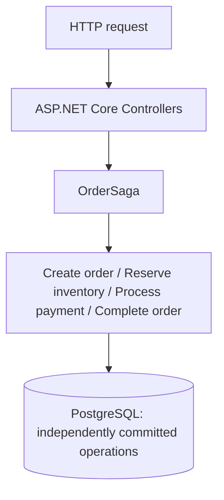
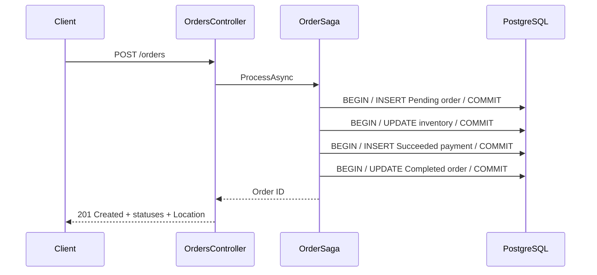

# Saga Pattern

> **Work in Progress** — M4 Saga Orchestration is complete. [Implementation plan](PLAN.md).
>
> An explicit Saga now coordinates the workflow. Compensating actions are intentionally not implemented yet.

## Scenario and motivation

An order is created, one inventory item is reserved, a simulated payment outcome is recorded, and the order is completed. This milestone establishes the successful baseline for a business process whose operations commit independently. M3 introduces deterministic payment failure after inventory commits.

The minimal domain contains `Order` (Id, Pending/Completed status, CreatedAtUtc), `InventoryItem` (Id, Name, AvailableQuantity, ReservedQuantity), and `Payment` (Id, OrderId, Amount, Succeeded/Failed status, CreatedAtUtc). The deterministic Demo Item starts with 10 available units and no reservations. Successful completion retains the reservation; fulfillment is outside this example.

## Implementation and transaction boundaries

The controller delegates to `OrderSaga` in Infrastructure. The Saga coordinates `OrderOperations`, which owns the four independently committed persistence operations. Domain entities contain the small business behaviors. EF configuration and DbContext live in Infrastructure; Domain has no project dependencies. API references Domain and Infrastructure. There is no Application project.

Each of the four explicit operations creates and disposes its own DbContext and local database transaction. It awaits SaveChanges and COMMIT before returning. There is no outer transaction:

```text
Order commit → Inventory commit → Payment commit → Order completion commit
```

Using one PostgreSQL instance does not make the workflow atomic. The default payment succeeds; an explicit failure stops processing before order completion. Inventory uses optimistic concurrency to reject a stale stock update; no retry policy is included.





## Running the example

From `05-saga-pattern`:

```bash
docker compose up --build
```

Compose starts PostgreSQL 17 and the .NET 10 API. PostgreSQL's healthcheck gates API startup. The API automatically applies the initial EF Core migration and deterministic inventory seed in Development (and other non-production environments). Production never migrates automatically and requires controlled migration execution before starting the API.

Defaults work without a `.env` file. Copy `.env.example` to `.env` to override local database credentials or ports. These defaults are local demo credentials. API is at http://localhost:8085; PostgreSQL is at localhost:5545.

```bash
curl -i -X POST http://localhost:8085/orders \
  -H "Content-Type: application/json" \
  -d '{"inventoryItemId":"11111111-1111-1111-1111-111111111111","quantity":1,"amount":100}'
```

The response contains `orderId`, `orderStatus: "Completed"`, and `paymentStatus: "Succeeded"`. Use the returned ID:

```bash
curl http://localhost:8085/orders/<orderId>
curl http://localhost:8085/inventory/11111111-1111-1111-1111-111111111111
docker compose logs api
```

After the first request, available inventory is 9 and reserved inventory is 1. Logs show Order created, Inventory reserved, Payment succeeded, and Order completed with structured IDs. Further requests consume more stock; keep requested quantity within available inventory. No compensation is implemented.

To reset only this PoC's data:

```bash
docker compose down -v
docker compose up --build
```

## Solution and tests

```text
EngineeringPlayground.Saga.sln
src/
  EngineeringPlayground.Saga.Api/
  EngineeringPlayground.Saga.Domain/
  EngineeringPlayground.Saga.Infrastructure/
tests/
  EngineeringPlayground.Saga.IntegrationTests/
```

```bash
dotnet format
dotnet build
dotnet test
docker compose config
```

Tests require a running Docker daemon. Testcontainers starts a separate PostgreSQL container with a dynamically allocated port for each test and waits for readiness. Migrations provide known inventory state. No local database reset or existing Compose environment is required. Tests inspect persisted state using fresh DbContexts: one invokes the production Saga entry path and covers the completed workflow; one invokes the same Saga with deterministic payment failure and proves partial failure leaves inventory reserved and the order Pending; the other checks committed state after every operation before the next one begins. Containers are disposed after each test.

For host development, start Compose PostgreSQL and run the API with the Development profile. Its development connection string matches Compose defaults; override ConnectionStrings__Orders when changing database settings.

## Trade-offs and use

This small synchronous baseline makes separate commits easy to inspect without extra infrastructure. A failed later operation can leave previously committed state, and the current milestone provides no recovery, idempotency, or compensation. Payment is simulated, and inventory is aggregated rather than tracked per order.

Use this milestone to understand independently committed business operations and observe partial failure after an independent inventory commit. Use a single local transaction when the actual business operation can and should be atomic. This incomplete milestone is not a production order or payment system.

## Partial Failure

Send a valid request selecting the deterministic failure outcome:

```bash
curl -i -X POST http://localhost:8085/orders \
  -H "Content-Type: application/json" \
  -d '{"inventoryItemId":"11111111-1111-1111-1111-111111111111","quantity":1,"amount":100,"paymentMode":"Fail"}'
```

Omitting `paymentMode` defaults to `Succeed`. Only `Succeed` and `Fail` are accepted; malformed selectors return 400 before processing. A valid `Fail` request returns HTTP 422 with `orderId`, `orderStatus: "Pending"`, and `paymentStatus: "Failed"`. Use that ID to inspect committed state:

```bash
curl http://localhost:8085/orders/<orderId>
curl http://localhost:8085/inventory/11111111-1111-1111-1111-111111111111
```

From a clean database, failure alone leaves available inventory at 9 and reserved inventory at 1. If the successful walkthrough ran first, the totals are 8 available and 2 reserved. The order remains Pending and the failed payment record is persisted.

```mermaid
sequenceDiagram
    participant Client
    participant Processor as OrderSaga
    participant DB as PostgreSQL
    Client->>Processor: POST /orders (paymentMode: Fail)
    Processor->>DB: BEGIN / INSERT Pending order / COMMIT
    Processor->>DB: BEGIN / UPDATE inventory reservation / COMMIT
    Processor->>DB: BEGIN / INSERT Failed payment / COMMIT
    Note over Processor: Stop; no order completion or inventory release
    Processor-->>Client: HTTP 422 + order ID and statuses
    Client->>DB: Fresh reads: Pending order, reserved inventory, Failed payment
```

Order creation commits first, inventory reservation commits next, and only then does simulated payment fail. The failed outcome is recorded in its own committed transaction; this demo does not cause a database error or payment transaction rollback. Logs show Order created, Inventory reserved, Payment failed, and Order Saga stopped with identifiers.

A database rollback affects only the transaction being rolled back. If transaction A reserves inventory and commits, a failure or rollback in payment transaction B cannot retroactively undo A. The payment failure cannot roll back the already committed inventory transaction, leaving a partial business state.

The PoC intentionally preserves independent commit boundaries instead of wrapping all steps in one large transaction. In a distributed workflow these operations might belong to separate services, databases, or external providers. One PostgreSQL instance keeps this example small while exposing the same boundary problem.

M4 intentionally leaves the system incomplete. M5 introduces compensating actions. There is no cancellation, inventory release, retry, or automatic cleanup here. Adding the Failed enum value requires no migration: payment status already uses an unconstrained string column, and its schema and EF model mapping remain unchanged.

## Saga Orchestration

Before M4, sequential application logic in `OrderProcessor` owned the entire workflow. Now `OrderSaga` explicitly owns process progression: which step runs next, and what happens when payment fails. `OrderOperations` contains only the local database operations; there is exactly one process coordinator, with no outer transaction or persisted Saga state.

```text
Controller → OrderSaga
               ├── Create Order (COMMIT)
               ├── Reserve Inventory (COMMIT)
               ├── Process Payment (COMMIT)
               └── Payment succeeded? Complete Order (COMMIT) : Stop
```

Introducing a Saga orchestrator does not automatically undo previously committed work.

```text
Reserve Inventory → COMMIT → Payment fails → Saga stops → Inventory is still reserved
```

The successful invocation leaves a Completed order, Succeeded payment, and persisted reservation. The failed invocation leaves a Pending order, Failed payment, and persisted reservation. Expected payment failure is a business result; unexpected infrastructure failures propagate as exceptions. Cancellation tokens pass through every step; cancellation does not compensate committed work.

This PoC uses orchestration because one explicit coordinator makes step order, decisions, failure flow, and future compensation easy to observe. M5 will replace the payment-failure stop with explicit compensation. There is no choreography or messaging infrastructure.
