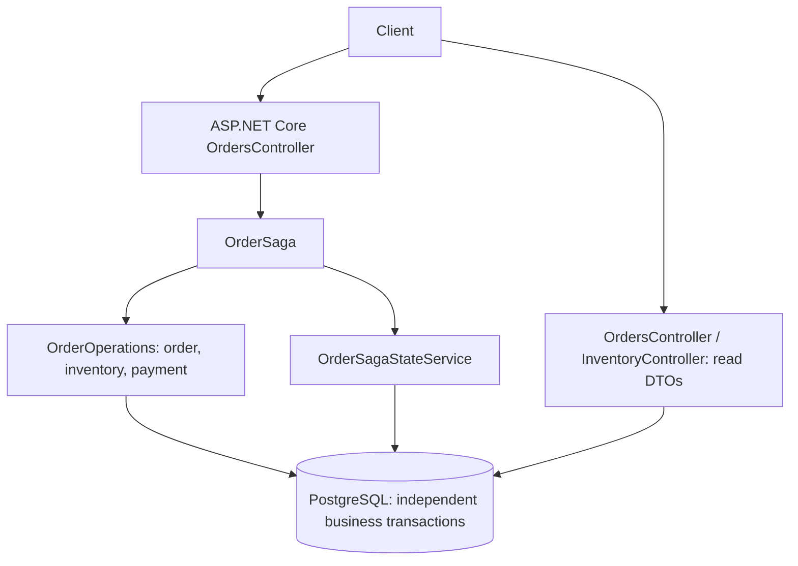

# Architecture

One API application, one database, and independent local commits. Arrows show runtime calls, not project dependencies.

Domain owns entities and business rules. Infrastructure owns the orchestrator, operations, EF Core context, mappings, and migrations. API owns HTTP DTOs/controllers and applies migrations only outside Production. No broker or background Worker exists.
