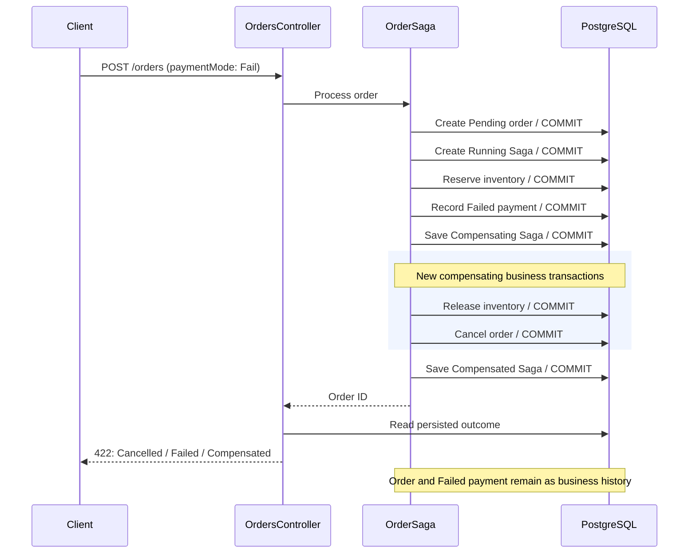

# Successful Compensation

Payment failure is a committed business result. Release is a new transaction, separate from the original reservation.

```mermaid
sequenceDiagram
    participant Client
    participant API as OrdersController
    participant Saga as OrderSaga
    participant DB as PostgreSQL
    Client->>API: POST /orders (paymentMode: Fail)
    API->>Saga: Process order
    Saga->>DB: Create Pending order / COMMIT
    Saga->>DB: Create Running Saga / COMMIT
    Saga->>DB: Reserve inventory / COMMIT
    Saga->>DB: Record Failed payment / COMMIT
    Saga->>DB: Save Compensating Saga / COMMIT
    rect rgb(240, 245, 255)
        Note over Saga,DB: New compensating business transactions
        Saga->>DB: Release inventory / COMMIT
        Saga->>DB: Cancel order / COMMIT
    end
    Saga->>DB: Save Compensated Saga / COMMIT
    Saga-->>API: Order ID
    API->>DB: Read persisted outcome
    API-->>Client: 422: Cancelled / Failed / Compensated
    Note over Saga,DB: Order and Failed payment remain as business history
```
